### 待补充知识点

工作经历：

* springboot 中自定义注解实现操作员日志功能 

* 压测问题反馈，工具使用

中间件：

* redis的sential
* zk和eurka的cp ap 以及主节点的选取

* ThreadLocal的内存泄漏问题
* CAS自旋锁、基础锁的概念

基础知识：

1. 基础算法的手写
   
   1. 快速排序
   
2. k8s和es的基础知识

   1. k8s管理容器
   2. es全文检索
   
3. 广度：spring技术-nosql。

   深度：线程池，java底层。

问题点：

表设计根本没有范式，这里关联一下那里关联一下；

一个业务方法普遍七八十行以上，方法职责不单一，注释不清晰，变量名取得很随意，参数传递和返回不讲究，异常处理就是一个try包整个方法；

功能的抽象层次不统一，该用AOP的时候不用，设计模式一点也没有；

工具类都是别人帮忙封装的，相同的逻辑从来不试图抽取，而是大量的复制粘贴改改参数。

一个单元测试都没有

### 高频知识点

* jvm类加载过程、springbean加载过程

* 双亲委派机制
* 数据库索引，索引类型，索引底层数据结构
* 索引到常见的锁、乐观锁、悲观。幻读脏读产生的原因，如何避免

**TODO Important 不知道也要说思路，根据自己的思路输出大概的猜想和实现，或者让面试引导自己去理解和学习**

### 自我介绍

工作内容，主要负责方面，主要做的事情

注意说话时的节奏和技巧

### 反问点：

1. 工作主要负责，系统目前使用的架构。
2. 工作地点、薪资，公积金比例，年终奖（是否转正后满一年才有年终奖和调薪），调薪晋升周期
3. 总共几轮。什么时候给结果。前几轮的面试认可度，根据反馈对于薪资协商，适当报高

---

### JVM内存结构

参考：[JVM调优总结](https://www.cnblogs.com/andy-zhou/p/5327288.html)

#### JVM内存模型

* jvm线程共享区域
  * heap堆：java对象，垃圾回收重点区域
  * 元数据（方法区）：final，static等常量，类信息（类方法，接口等）、运行时常量池

* jvm线程私有区域
  * 虚拟机栈：线程中每个方法执行时，创建一个栈帧用于存储局部变量表、操作数栈、动态连接、方法出口等信息。每一个方法被调用直至执行完毕的过程，就对应着一个栈帧在虚拟机栈中从入栈到出栈的过程，局部变量
  * 本地方法栈：native调用本地方法
  * 程序计数器：字节码指令、程序控制流的指示器，分支、循环、跳转、异常处理、线程恢复等基础功能都需要依赖这个计数器来完成。

#### jvm堆栈

**jvm堆**

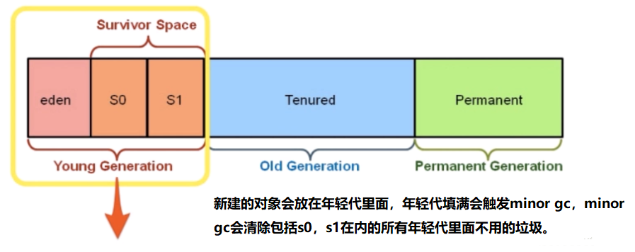

堆（数据结构）：堆可以被看成是一棵树，如：堆排序。

栈（数据结构）：一种先进后出的数据结构。

堆中存的是对象。栈中存的是基本数据类型和堆中对象的引用。

栈是运行时单位，堆是存储单位；栈解决程序的运行问题，即程序如何执行，或者说如何处理数据；堆解决的是数据存储的问题，即数据怎么放、放在哪儿。

面向对象就是堆和栈的完美结合。其实，面向对象方式的程序与以前结构化的程序在执行上没有任何区别。**但是，面向对象的引入，使得对待问题的思考方式发生了改变，而更接近于自然方式的思考。当我们把对象拆开，你会发现**

**对象的属性其实就是数据，存放在堆中；**

**而对象的行为（方法），就是运行逻辑，放在栈中。**

**我们在编写对象的时候，其实即编写了数据结构，也编写的处理数据的逻辑。不得不承认，面向对象的设计，确实很美**

堆中存的是对象。栈中存的是基本数据类型和堆中对象的引用。


#### JVM的gc算法

gc调优：heap内存的合理分配。设置年轻代和老年代的比值，调整gc回收器的选择

标记清除：

一阶段对于被引用的对象进行标记。二阶段遍历整个heap，对所有未标记的对象进行清除。

缺点-会产生内存碎片，且需要暂停应用

复制：

每次只是用内存区域的一般。gc时，将正在使用的对象复制到另一半空闲区域同时整理。

缺点：内存区域真正使用的只有一半

标记整理：

一阶段标记被引用的对象，二阶段清理未被标记的对象，同时整理未被清除的对象到堆的一块连续内存区域

#### JVM的gc策略

jvm的对象


**Scavenge GC（Minor GC）**

是主要对Young的GC

一般情况下，当新对象生成，并且在Eden申请空间失败时，就会触发Scavenge GC，对Eden区域进行GC，清除非存活对象，并且把尚且存活的对象移动到Survivor区。

**Major GC**

老年代GC称为Major GC

**Full GC**

触发full gc的条件

* 由Eden区、From Space区向To Space区复制时，对象大小大于To Space可用内存，则把该对象转存到老年代，且老年代的可用内存小于该对象大小

* System.gc()方法的调用

对整个堆进行整理，包括Young、Tenured和Perm。

##### 可以直接在老年代进行对象创建吗？

* 分配的对象大于eden space空间
* eden space的剩余空间不总，直接分配到老年代
* 大对象直接进入老年代，大对象一般指对象占用的连续内存空间过大，比如很长的字符串和数组，-XX:PretenureSizeThreshold参数控制是否进入老年代

#### JVM如何判断对象生死（即jvm如何标记被引用的对象）

* 引用计数算法

  给对象设置一个引用计数器，被引用一次计数器加一次，引用失效就减一次

* 可达性分析算法

  构造类似树结构的引用分析树，根节点是GC-Root起始点，被引用的对象会加载到树节点，引用失效就断开树节点。

  判断对象生死就从根节点遍历，能遍历到是还在被引用的对象，遍历不到的就是失效的对象
  
  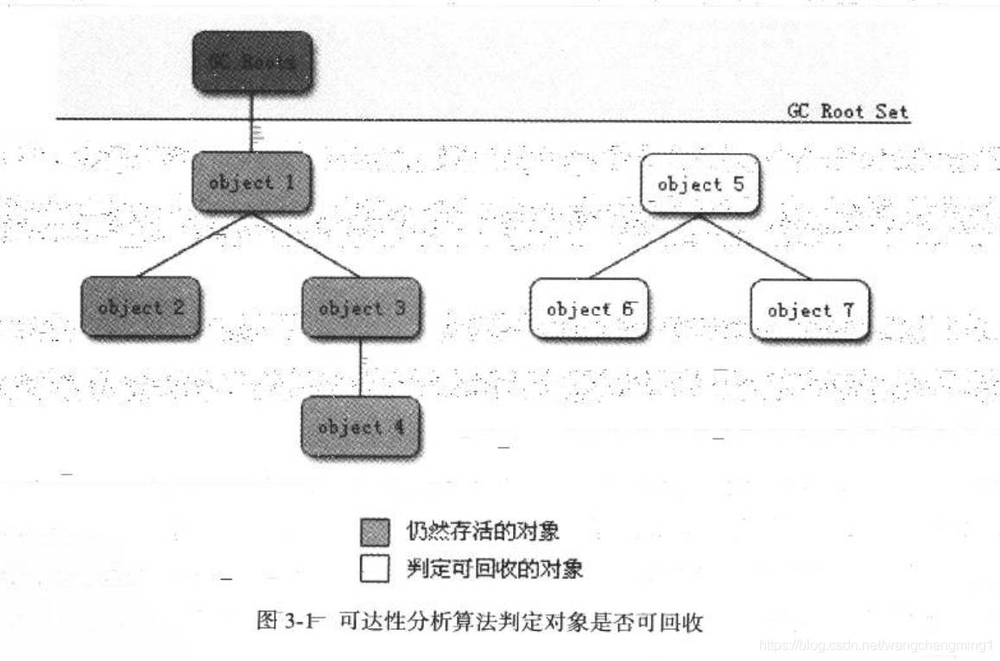
  
  `Java中可作为GC Roots的对象包括`：
  
  - 虚拟机栈（栈帧中的局部变量表）中引用的对象。
  - 方法区中类静态属性引用的对象。
  - 方法区中常量引用的对象。
  - 本地方法栈中JNI（通常情况下的native方法）引用的对象。
  
  为什么它们可以作为GC Roots？因为这些对象肯定不会被回收。比如，虚拟机栈中是正在执行的方法，所以里面引用的对象不会被回收。

#### volatile

* 保证可见性
* 禁止指令重排
* 不保证原子性

volatile保证了修饰的共享变量在转换为汇编语言时，会加上一个以lock为前缀的指令，当CPU发现这个指令时，立即会做两件事情：

1. 将当前内核中线程工作内存中该共享变量刷新到主存；
2. 通知其他内核里缓存的该共享变量内存地址无效；

#### jvmOOM

从Java内存模型来看，除了程序计数器不会发生OOM外，哪些区域会发生OOM的情况呢？

1. **堆内存**，堆内存不足是最常见的发送OOM的原因之一。
   如果在堆中没有内存完成对象实例的分配，并且堆无法再扩展时，将抛出OutOfMemoryError异常，抛出的错误信息是“java.lang.OutOfMemoryError:Java heap space”。
   当前主流的JVM可以通过-Xmx和-Xms来控制堆内存的大小，发生堆上OOM的可能是存在内存泄露，也可能是堆大小分配不合理。
2. **Java虚拟机栈和本地方法栈**，这两个区域的区别不过是虚拟机栈为虚拟机执行Java方法服务，而本地方法栈则为虚拟机使用到的Native方法服务，在内存分配异常上是相同的。
   在JVM规范中，对Java虚拟机栈规定了两种异常：
   a. 如果线程请求的栈大于所分配的栈大小，则抛出StackOverFlowError错误，比如进行了一个不会停止的递归调用；
   b. 如果虚拟机栈是可以动态拓展的，拓展时无法申请到足够的内存，则抛出OutOfMemoryError错误。
3. **直接内存**：直接内存虽然不是虚拟机运行时数据区的一部分，但既然是内存，就会受到物理内存的限制。在JDK1.4中引入的NIO使用Native函数库在堆外内存上直接分配内存，但直接内存不足时，也会导致OOM。
4. **方法区**：随着Metaspace元数据区的引入，方法区的OOM错误信息也变成了“java.lang.OutOfMemoryError:Metaspace”
5. 对于旧版本的Oracle JDK，由于永久代的大小有限，而JVM对永久代的垃圾回收并不积极，如果往永久代不断写入数据，例如String.Intern()的调用，在永久代占用太多空间导致内存不足，也会出现OOM的问题，对应的错误信息为“java.lang.OutOfMemoryError:PermGen space”

| 内存区域   | 是否线程私有 | 是否会发生OOM |
| ---------- | ------------ | ------------- |
| 程序计数器 | 是           | 否            |
| 虚拟机栈   | 是           | 是            |
| 本地方法栈 | 是           | 是            |
| 方法区     | 否           | 是            |
| 直接内存   | 否           | 是            |
| 堆         | 否           | 是            |

### JAVA基础

#### JVM类加载过程

jvm的类加载一般分为 7个阶段：加载、验证、准备、解析、初始化、使用、卸载

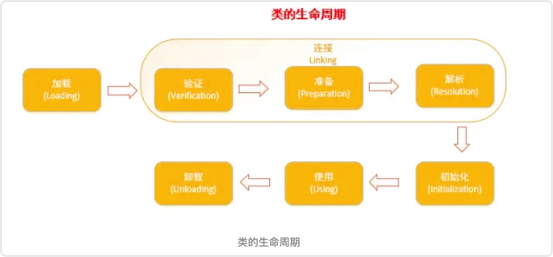

加载、验证、准备、初始化和卸载5个阶段的顺序是确定的，类的加载过程必须按照这种顺序按部就班地开始，而解析阶段则不一定：它在某些情况下可以再初始化阶段后再开始，这是为了支持Java语言的运行时绑定(也称动态绑定或晚期绑定)，大概步骤如下

~~~properties
装载：查找和导入Class文件

链接：把类的二进制数据合并到JRE中
​	校验：检查载入Class文件数据的正确性
​	准备：给类的静态变量分配存储空间
​	解析：将符号引用转成直接引用

初始化：对类的静态变量，静态代码块执行初始化操作
~~~

**加载：**

类加载过程中，类加载时机：`new`关键字，`static`关键字修饰，反射调用，虚拟机指定main之类

- 类的实例化是指创建一个类的实例(对象)的过程；实例化一定会走构造函数
- 类的初始化是指为类各个成员赋初始值的过程，是类生命周期中的一个阶段。初始化是对类的成员的初始化，不一定会走构造函数

1. 通过类的全限定名获取类的二进制字节流。
2. 存储字节流中的静态存储转化为方法区运行时的数据结构。
3. jvm堆中生成代表这个类的java.lang.Class实例

类加载和类连接阶段，可能并不是按照指定的先后顺序，可能在类加载的过程中，类连接操作已经开始了。但是这两个阶段的开始时间任然保持固定的先后顺序

**验证：**

1. class文件格式验证：是否以魔数开头，常量池是否有不被支持的类型
2. 元数据验证，类文件是否符合java语言规范
3. 字节码验证，符号引用验证

**准备：**

为类变量(static修饰)分配内存，然后初始化其值

如果类变量是常量，则直接赋值为该常量值否则为java类型的默认的零值

**解析：**

将常量池中的符号引用替换成直接引用，符号引用指的是：new、getField等替换成直接引用即执行目标地址

**初始化：**

类初始化是类加载过程的最后一步，初始化是执行类构造器cinit方法的过程.

除了在加载阶段用户应用程序可以通过自定义类加载器参与之外，其余动作完全由虚拟机主导和控制。到了初始化阶段，才真正开始执行类中定义的java程序代码(字节码)。

有且只有下面5种情况才会立即初始化类，称为主动引用：

- new 对象时
- 读取或设置类的静态字段（除了 被final，已在编译期把结果放入常量池的 静态字段）或调用类的静态方法时；
- 用java.lang.reflect包的方法对类进行反射调用没初始化过的类时
- 初始化一个类时发现其父类没初始化，则要先初始化其父类
- 含main方法的那个类，jvm启动时，需要指定一个执行主类，jvm先初始化这个类

其他对类的引用 称为被动引用，加载类时不会进行初始化动作

##### 双亲委派模型

- **BootstrapClassLoader(启动类加载器)** ：最顶层的加载类，由C++实现，负责加载 %JAVA_HOME%/lib目录下的jar包和类或者或被 -Xbootclasspath参数指定的路径中的所有类。
- **ExtensionClassLoader(扩展类加载器)** ：主要负责加载目录 %JRE_HOME%/lib/ext 目录下的jar包和类，或被 java.ext.dirs 系统变量所指定的路径下的jar包。
- **AppClassLoader(应用程序类加载器)** :面向我们用户的加载器，负责加载当前应用classpath下的所有jar包和类。

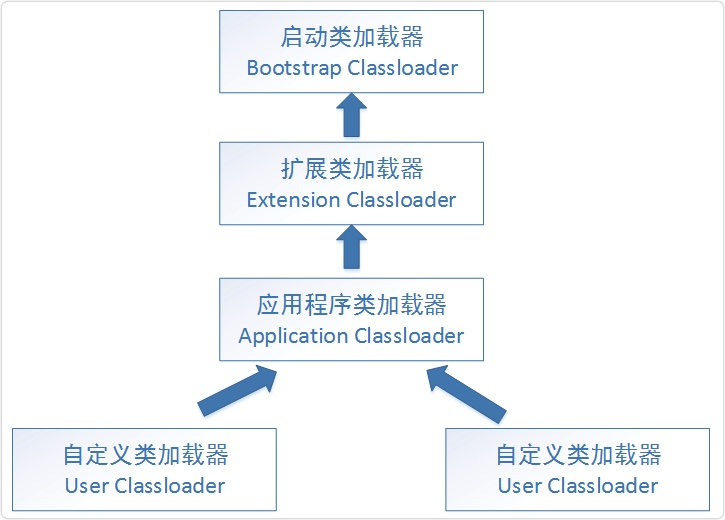

双亲委派是指每次收到类加载请求时，先将请求委派给父类加载器完成（所有加载请求最终会委派到顶层的Bootstrap ClassLoader加载器中），如果父类加载器无法完成这个加载（该加载器的**搜索范围**中没有找到对应的类），子类尝试自己加载， 如果都没加载到，则会抛出 ClassNotFoundException 异常， 看到这里其实就解释了文章开头提出的第一个问题，父加载器已经加载了JDK 中的 String.class 文件，所以我们不能定义同名的 String java 文件。

*为什么会有这样的规矩设定？*

> 因为这样可以避免重复加载，当父亲已经加载了该类的时候，就没有必要 ClassLoader 再加载一次。考虑到安全因素，我们试想一下，如果不使用这种委托模式，那我们就可以随时使用自定义的String来动态替代java核心api中定义的类型，这样会存在非常大的安全隐患，而双亲委托的方式，就可以避免这种情况，因为String 已经在启动时就被引导类加载器（Bootstrcp ClassLoader）加载，所以用户自定义的ClassLoader永远也无法加载一个自己写的String，除非你改变 JDK 中 ClassLoader 搜索类的默认算法。

#### 静态变量加载，静态代码块加载时间点

当类加载器将类加载到JVM中的时候就会创建静态变量，这跟对象是否创建无关。静态变量加载的时候就会分配内存空间。

静态代码块的代码只会在类第一次初始化的时候执行一次。

一个类可以有多个静态代码块，它并不是类的成员，也没有返回值，并且不能直接调用。静态代码块不能包含this或者super,它们通常被用初始化静态变量。

**类中代码块的加载顺序：**

静态块/静态变量>构造块>构造方法。

~~~java
public class TestStaticLoadSort {
    private static String str = "h";
    public TestStaticLoadSort() {
        System.out.println("构造方法.");
    }
    static {
        str += "i";
        System.out.println("静态块");
    }
    {
        System.out.println("构造块");
    }
    public static void main(String[] args) {
        TestStaticLoadSort tss = new TestStaticLoadSort();
        System.out.println(tss.str);
        TestStaticLoadSort tss1 = new TestStaticLoadSort();
    }
    /**
     * ===============输出结果=============
     * 静态块
     * 构造块
     * 构造方法.
     * hi
     * 构造块
     * 构造方法.
     */
}
~~~

#### JDK代理、cglib代理

一般的话，如果业务类实现了接口，jdk的代理可以直接代理业务类的接口。

而cglib代理一般是针对类本身进行代理

* JDK动态代理只能对实现了接口的类生成代理，而不能针对类
* CGLIB是针对类实现代理，主要是对指定的类生成一个子类，覆盖其中的方法，因为是继承，所以该类或方法最好不要声明成final 

**JDK静态代理**

1. 新建功能接口

2. 新建功能接口实现的业务bean

3. 新建业务bean的代理类proxyBean，代理类中

   1. 实例化被代理的类。

   2. 实现功能接口，业务bean功能被proxyBean代理，加上自定义代理逻辑

4. proxyBean实例化，具体业务场景使用实际调用的被proxyBean代理后的业务bean的功能

**JDK动态代理**

整个JDK动态代理的秘密也就这些，简单一句话，动态代理就是要生成一个包装类对象，由于代理的对象是动态的，所以叫动态代理。由于我们需要增强，这个增强是需要留给开发人员开发代码的，因此代理类不能直接包含被代理对象，而是一个InvocationHandler，该InvocationHandler包含被代理对象，并负责分发请求给被代理对象，分发前后均可以做增强。从原理可以看出，JDK动态代理是“对象”的代理。

1. 动态代理类实现invocationHandler接口，实现invode方法

   invoke接受三个参数，被代理类proxy，被代理方法Method，被代理方法入参args。

   Method.invoke(targe,args) //targe是被代理类

2. 动态代理类构造方法接受需要被代理的类，以Object接受

3. 动态代理类提供getProxy方法初始化，Proxy.newProxyInstance，接受的入参为 被代理类的类加载器，类实现，代理类。

4. NeedProxyInteface  needProxy=  new JDKDynamicClass(new NeedProxy).getProxy();

~~~java
public class JdkDynamicProxyMishu implements InvocationHandler {
    //需要被动态代理的类
    private Object target;

    public JdkDynamicProxyMishu(Object target) {
        this.target = target;
    }

    /**
     * 获取被代理接口实例对象
     *
     * @param <T>
     * @return
     */
    public <T> T getProxy() {
        return (T) Proxy.newProxyInstance(target.getClass().getClassLoader(), target.getClass().getInterfaces(), this);
    }

    /**
     * 代理调用被代理的类
     *
     * @param proxy
     * @param method
     * @param args
     * @return
     * @throws Throwable
     */
    @Override
    public Object invoke(Object proxy, Method method, Object[] args) throws Throwable {
        System.out.println("dynamic before === proxy: method:" + method + " args:" + args);
        Object res = method.invoke(target, args);
        System.out.println("dynamic after === proxy: method:" + method + " args:" + args);
        return res;
    }
}
~~~

Main函数中

~~~java
// 2 jdk动态代理
        // 保存生成的代理类的字节码文件
        // 启动设置 -Dsun.misc.ProxyGenerator.saveGeneratedFiles=true
        Gongneng proxyLongzong = new JdkDynamicProxyMishu(new Laozong()).getProxy();
        proxyLongzong.chifan();
        String xiaomubiao = proxyLongzong.xiaomubiao();
        System.out.println(xiaomubiao);
        String jianghua1 = proxyLongzong.jianghua("讲话内容");
        System.out.println(jianghua1);

        Gongneng proxyLongzong2 = new JdkDynamicProxyMishu(new Laozong2()).getProxy();
        proxyLongzong2.chifan();
        String xiaomubiao1 = proxyLongzong2.xiaomubiao();
        System.out.println(xiaomubiao1);
        String jianghua2 = proxyLongzong2.jianghua("讲话内容");
        System.out.println(jianghua2);
~~~

**cglib动态代理**

它和jdk动态代理有所不同，对外表现上看CreatProxyedObj，它只需要一个类型clazz就可以产生一个代理对象， 所以说是“类的代理”，且创造的对象通过打印类型发现也是一个新的类型**。不同于jdk动态代理，jdk动态代理要求对象必须实现接口（三个参数的第二个参数），cglib对此没有要求。**

"代理"的目的是构造一个和被代理的对象有同样行为的对象，一个对象的行为是在类中定义的，对象只是类的实例。所以构造代理，不一定非得通过持有、包装对象这一种方式。

**通过“继承”可以继承父类所有的公开方法，然后可以重写这些方法，在重写时对这些方法增强，这就是cglib的思想。根据里氏代换原则（LSP），父类需要出现的地方，子类可以出现，所以cglib实现的代理也是可以被正常使用的**

1. 代理类需要实现MethodInterceptor接口
2. 使用时需要声明指定被代理类

~~~java
//代理类声明
public class NewMishu implements MethodInterceptor {
    @Override
    public Object intercept(Object o, Method method, Object[] objects, MethodProxy methodProxy) throws Throwable {
        System.out.println("cglib 输出预约时间");
        Object result =  methodProxy.invokeSuper(o,objects);
        System.out.println("cglib 输出记录访客信息");
        return result;
    }
}

//指定被代理类和代理类，调用代理方法
public class NenFangwenzhe {
    public static void main(String[] args) {
        Enhancer enhancer = new Enhancer();
        enhancer.setSuperclass(Laozong.class);
        enhancer.setCallback(new NewMishu());
        Laozong laozong =  (Laozong)enhancer.create();
        laozong.chifan();
    }
}
~~~

**JDK中具体的动态代理类是怎么产生的呢？**

**产生代理类$Proxy0类**

执行了Proxy.newProxyInstance(ClassLoader loader, Class[] interfaces, InvocationHandler h)

将产生$Proxy0类，它继承Proxy对象，并根据第二个参数，实现了被代理类的所有接口，自然就可以生成接口要实现的所有方法了（这时候会重写hashcode，toString和equals三个方法），但是还没有具体的实现体；

**将代理类$Proxy0类加载到JVM中**
这时候是根据Proxy.newProxyInstance(ClassLoader loader, Class[] interfaces, InvocationHandler h)它的第一个参数----就是被代理类的类加载器，把当前的代理类加载到JVM中

**创建代理类$Proxy0类的对象**
调用的$Proxy0类的$Proxy0（InvocationHandler）构造函数，生成$Proxy0类的对象
参数就是Proxy.newProxyInstance(ClassLoader loader, Class[] interfaces, InvocationHandler h)它的第三个参数

这个参数就是我们自己实现的InvocationHandler对象，我们知道InvocationHandler对象中组合加入了代理类代理的接口类的实现类；所以，$Proxy0对象调用所有要实现的接口的方法，都会调用InvocationHandler对象的invoke（）方法实现；

#### object类的方法有哪些

toString、hashcode、equals

wait、notify、notifyall

#### 抽象类可不可以实例化?

抽象类被继承后，继承类实例化，会触发抽象类的构造函数

但是不能直接使用new关键字去实例化

~~~java
abstract class B {
    private String str;
    
    public B(String a) {
        System.out.println("父类已经实例化");
        this.str=a;
        System.out.println(str);
    }
    public abstract void play();
}

public class A extends B{
    public A(String a) {
        super(a);
        System.out.println("子类已经实例化");
    }
    @Override
    public void play() {
        System.out.println("我实现了父类的方法");
    }
    public static void main(String[] args) {
        B aa=new A("a");
    }
}

父类已经实例化
a
子类已经实例化
~~~

#### 字节流、字符流的区别

* FileInputStream // 文件的字节输入流

* FileOutputStream // 文件的字节输出流

* FileReader // 文件的字符输入流

* FileWriter // 文件的字符输出流

**Java的字节流**
InputStream是所有字节输入流的祖先，而OutputStream是所有字节输出流的祖先。

**Java的字符流**
Reader是所有读取字符串输入流的祖先，而writer是所有输出字符串的祖先。
InputStream，OutputStream,Reader,writer都是抽象类。所以不能直接new

字节流是最基本的，所有的InputStream和OutputStream的子类都是,主要用在处理二进制数据，它是按字节来处理的
但实际中很多的数据是文本，又提出了字符流的概念，它是按虚拟机的encode来处理，也就是要进行字符集的转化
这两个之间通过 InputStreamReader,OutputStreamWriter来关联，实际上是通过byte[]和String来关联
在实际开发中出现的汉字问题实际上都是在字符流和字节流之间转化不统一而造成的

在从字节流转化为字符流时，实际上就是byte[]转化为String时，
public String(byte bytes[], String charsetName)
有一个关键的参数字符集编码，通常我们都省略了，那系统就用操作系统的lang
而在字符流转化为字节流时，实际上是String转化为byte[]时，
byte[] String.getBytes(String charsetName)

#### hash算法原理，怎么避免hash重复

**一般来说是hash的目的是将非固定长度的输入转化成固定长度的输出，该输出被称为散列值**

**哈希函数H(key)和处理冲突方法**将一组关键字映射到一个有限的地址区间上，并以关键字在地址区间中的象作为记录在表中的存储位置，这种表称为**哈希表或散列表**。这一映像称为**散列**，所得存储位置称为**哈希地址或散列地址**。

* hash一般是关键字加hash函数

* hash函数一般有

  * 随机数法

  * 直接寻址：即取关键字或者关键字的线性函数的值为散列地

**避免hash重复**

**开放地址法**

开放地执法有一个公式:Hi=(H(key)+di) MOD m i=1,2,…,k(k<=m-1)
其中，m为哈希表的表长。di 是产生冲突的时候的增量序列。如果di值可能为1,2,3,…m-1，称线性探测再散列。
如果di取1，则每次冲突之后，向后移动1个位置.如果di取值可能为1,-1,2,-2,4,-4,9,-9,16,-16,…k*k,-k*k(k<=m/2)，称二次探测再散列。
如果di取值可能为伪随机数列。称**伪随机探测再散列**。

**再哈希法**

当发生冲突时，使用第二个、第三个、哈希函数计算地址，直到无冲突时。缺点：计算时间增加。
比如上面第一次按照姓首字母进行哈希，如果产生冲突可以按照姓字母首字母第二位进行哈希，再冲突，第三位，直到不冲突为止

**链地址法（拉链法）**

将所有关键字为同义词的记录存储在同一线性链表中。如下：

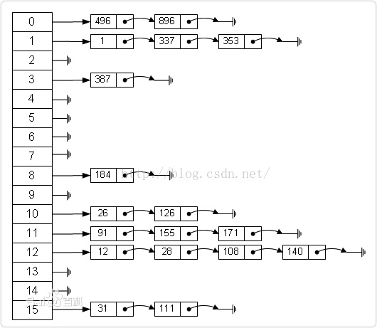

#### 有状态的请求，nginx是怎么处理的

保留状态属性直接转发

#### Java-Web

##### servlet、filter、listener的区别

本质都是servlet

* servlet是对请求的实际处理
  
* Init doGet doPost 、、、Destory
  
* filter是对请求的过滤

  filter能够在一个请求到达servlet之前预处理用户请求，也可以在离开servlet时处理http响应：在执行servlet之前，首先执行filter程序，并为之做一些预处理工作；

  根据程序需要修改请求和响应；在servlet被调用之后截获servlet的执行

  Init dofilter 

* Listener

  前两个一般是针对URL的

  listener一般是针对对象数据的变化

   监听器主要是用来监听 request seesion application 对象存取数据的变化

context-param -> listener -> filter -> servlet 

#### 强引用、软引用、弱引用

**强引用(StrongReference):**

强引用就是指在程序代码之中普遍存在的，比如下面这段代码中的object和str都是强引用：

```java
Object object = new Object();
String str = "hello";
```

~~~java
public class Main {
    public static void main(String[] args) {
        new Main().fun1();
    }
     
    public void fun1() {
        Object object = new Object();
        Object[] objArr = new Object[1000];
    }
}
~~~

例如运行到：`Object[] objArr = new Object[1000];`

如果内存不足，JVM会抛出OOM错误也不会回收object指向的对象。不过要注意的是，当fun1运行完之后，object和objArr都已经不存在了，所以它们指向的对象都会被JVM回收。如果想中断强引用和某个对象之间的关联，可以显示地将引用赋值为null，这样一来的话，JVM在合适的时间就会回收该对象。

**软引用(SoftReference)：**

软引用是用来表示一些有用但不是必须的对象。用软引用关联的对象，只有在内存不足的时候jvm才会回收改对象

~~~java
public class Main {
    public static void main(String[] args) {
        SoftReference<String> sr = new SoftReference<String>(new String("hello"));
        System.out.println(sr.get());
    }
}
~~~

**弱引用（WeakReference）:**

弱引用也是用来描述非必需对象的，当JVM进行垃圾回收时，无论内存是否充足，都会回收被弱引用关联的对象。在java中，用`java.lang.ref.WeakReference`类来表示。下面是使用示例：

~~~java
public class Main {
    public static void main(String[] args) {
     
        WeakReference<String> sr = new WeakReference<String>(new String("hello"));
         
        System.out.println(sr.get());
        System.gc();                //通知JVM的gc进行垃圾回收
        System.out.println(sr.get());
    }
}
~~~

**虚引用(PhantomReference)：**

虚引用和前面的软引用、弱引用不同，它并不影响对象的生命周期。在java中用java.lang.ref.PhantomReference类表示。如果一个对象与虚引用关联，则跟没有引用与之关联一样，在任何时候都可能被垃圾回收器回收。

~~~java
public class Main {
    public static void main(String[] args) {
        ReferenceQueue<String> queue = new ReferenceQueue<String>();
        PhantomReference<String> pr = new PhantomReference<String>(new String("hello"), queue);
        System.out.println(pr.get());
    }
}
~~~

#### 接口和抽象类的异同

相同：

* 都可以定义抽象方法，抽象方法都必须被子类或者实现类重写
* 都不能实例化对象
* 都可以定义public static 方法，public static final 常量

不同点：

* 抽象类需要用abstract修饰，且抽象方法需要abstact修饰。而接口类需要interface修饰，抽象方法直接定义即可

* 抽象类除了可以定义抽象方法，还可以和普通类一样正常定义常量和方法。而接口类，只能定义抽象方法，静态方法，final static常量  default方法。
* 一个类只能继承extends单个抽象类。而可以实现implement多个接口
* 抽象类是对象更具体的封装。而接口一般只是封装了对象的功能

#### int和Integer的区别

1、Integer是int的包装类，int则是java的一种基本数据类型 
2、Integer变量必须实例化后才能使用，而int变量不需要 
3、Integer实际是对象的引用，当new一个Integer时，实际上是生成一个指针指向此对象；而int则是直接存储数据值 
4、Integer的默认值是null，int的默认值是0

#### 常见Java异常

nullpointerexception

```java
java.lang.nullpointerexception
//这个异常大家肯定都经常遇到，异常的解释是"程序遇上了空指针"，简单地说就是调用了未经初始化的对象或者是不存在的对象，这个错误经常出现在创建图片，调用	数组这些操作中，比如图片未经初始化，或者图片创建时的路径错误等等。
```

Classnotfound

```java
 java.lang.classnotfoundexception
 //这个异常是很多原本在jb等开发环境中开发的程序员，把jb下的程序包放在wtk下编译经常出现的问题，异常的解释是"指定的类不存在"，这里主要考虑一下类的名称和路径是否正确即可，如果是在jb下做的程序包，一般都是默认加上package的，所以转到wtk下后要注意把package的路径加上。
```

```java
arrayindexoutofboundsexception//数组下标越界
illegalargumentexception//参数不合法
IOException//输入输出异常
```

### 算法基础

#### 时间复杂度

不论是数组、链表还是二叉树、二叉排序树（搜索树）、红黑树，我们要找到其中特定的一个元素，方法只有一个那就是挨个比较直到找到为止，这就造成了查找的时间复杂度总是与N有关系。

|      | 数组 | 链表 | 二叉树 | 二叉排序树    | 红黑树   |
| ---- | ---- | ---- | ------ | ------------- | -------- |
| 查找 | O(N) | O(N) | O(N)   | O(log2N)~O(N) | O(log2N) |

- **数组**：特指无序数组。假设数组中有N个元素，我们要找到其中一个特定的元素，通常要进过N/2次比较，所以时间复杂度上来说还是O(N)。如果数组是有序数组的话，可以折半查找，此时的时间复杂度是O(log2N)。
- **链表**：同理于数组，假设有N个元素，要找到其中一个特定的元素，时间复杂度还是O(N)。
- **二叉树**：注意是二叉树，父节点与左子节点、右子节点之间没有大小关系，实在不明白，可以看看这篇文章[二叉树（从建树、遍历到存储）Java](https://blog.csdn.net/dabusiGin/article/details/102785510)。此时要从N个节点中找到特定的节点，只能是遍历每一个元素，时间复杂度是O(N)。
- **二叉排序树**：此时父节点与左、右子节点之间就有大小关系了。在理想状态下即节点分布均匀的情况下相当于折半查找，所以时间复杂度是O(log2N)，最坏情况是出现左、右斜树，此时时间复杂度会降到O(N)，一般情况下时间复杂度会介于两者之间即O(N)到O(log2N)。
- **红黑树**：虽然红黑树在插入、删除操作上很是麻烦，但是对于查找操作跟二叉排序树是一模一样的，因为红黑树不过是加了平衡算法的二叉排序树而已，二叉排序树最基本的父节点与左、右子节点之间的大小关系肯定是满足的，所以时间复杂度是O(log2N)。

只看表达式的可能感觉不强烈，那我们假设N=1000000（一百万）。

|      | 数组              | 链表              | 二叉树            | 二叉排序树 | 红黑树 |
| ---- | ----------------- | ----------------- | ----------------- | ---------- | ------ |
| 查找 | 1000000（一百万） | 1000000（一百万） | 1000000（一百万） | 20~1000000 | 20     |

#### LRU算法（least recently used,最近最少使用）

算法根据数据的历史访问记录来进行淘汰数据，其核心思想是“如果数据最近被访问过，那么将来被访问的几率也更高”。

常见的实现是使用链表保存缓存

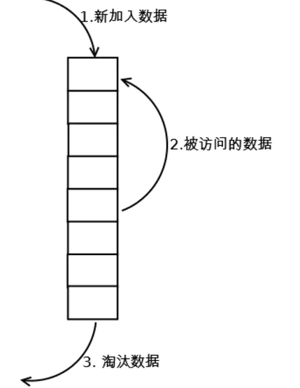

1. 新数据加入链表头部
2. 每当缓存命中，即缓存数据再次被访问，则将数据移到链表头部
3. 链表满的时候，丢弃链表尾部数据

【命中率】
 当存在热点数据时，LRU的效率很好，但偶发性的、周期性的批量操作会导致LRU命中率急剧下降，缓存污染情况比较严重。
 【复杂度】
 实现简单。
 【代价】
 命中时需要遍历链表，找到命中的数据块索引，然后需要将数据移到头部。

todo：优化热点数据

#### dijkstra算法求最短路径

todo

### 基本数据结构

* 常用基本数据结构

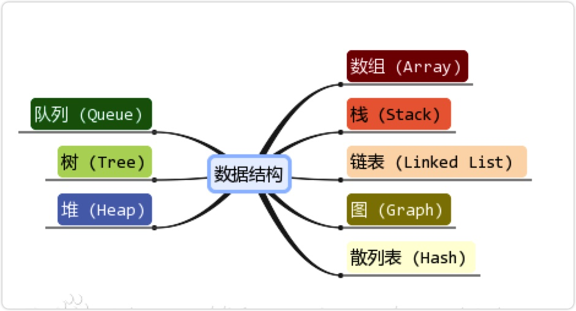

集合：数组

线性结构：栈、队列、链表

树形结构：堆

图形结构：散列表、图

* 数据结构分类：

  集合，线性结构，树形结构，图形结构（树、图也被称为非线性）

  1. 集合

     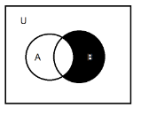

     数据结构中的元素之间除了“同属一个集合” 的相互关系外，别无其他关系；

  2. 线性结构

     数据结构中的元素存在一对一的相互关系

     线性结构的特点：在数据元素有限集中，除第一个元素无直接前驱，最后一个元素无直接后续以外，每个数据元素有且仅有一个直接前驱元素和一个直接后继元素。

     线性表定义：n个类型相同数据元素的有限序列。

     常用的线性结构：线性表、栈、队列、链表、数组

     栈：

     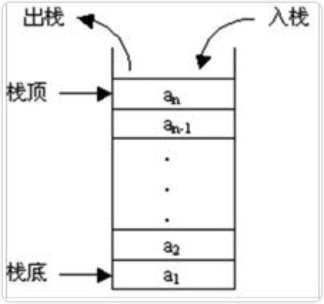

     队列：

     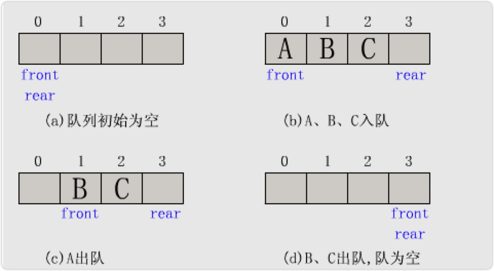

     链表：

     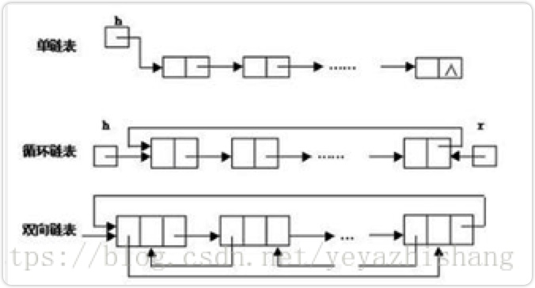

     

     数组：

     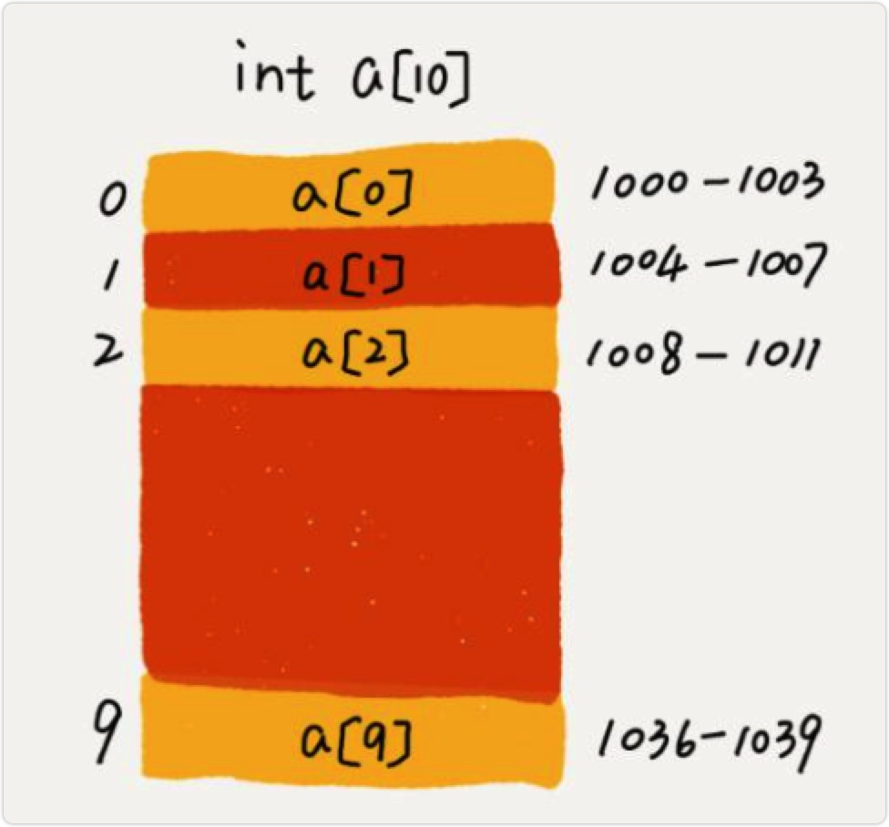

     注：线性表，栈和队列、数组的异同

     都是线性结构，都是逻辑结构的概念。都可以用顺序存储或链表存储；栈和队列是两种特殊的线性表，即受限的线性表，只是对插入、删除运算加以限制。

     线性表是一种抽象数据类型；数组是一种具体的数据结构，线性表是元素之间具有1对1的线性关系的数据元素的集合，而数组是具体的实现，即一组数据元素到数组下标的一一映射

  3. 树形结构

     **树**是一种数据结构，它是由n（n>=1）个有限节点组成一个具有层次关系的集合。

     拓展树（平衡二叉树、红黑树、B+树）

     简单二叉树：

     * 每个结点最多有两颗子树，结点的度最大为2。
     * 左子树和右子树是有顺序的，次序不能颠倒。
     * 即使某结点只有一个子树，也要区分左右子树。

     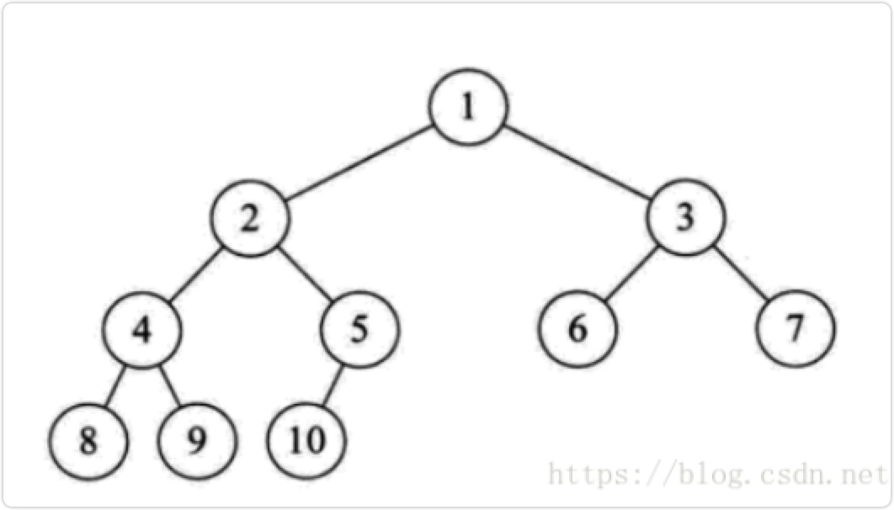

     堆：

     - 堆中某个节点的值总是不大于或不小于其父节点的值；
     - 堆总是一棵完全二叉树。

     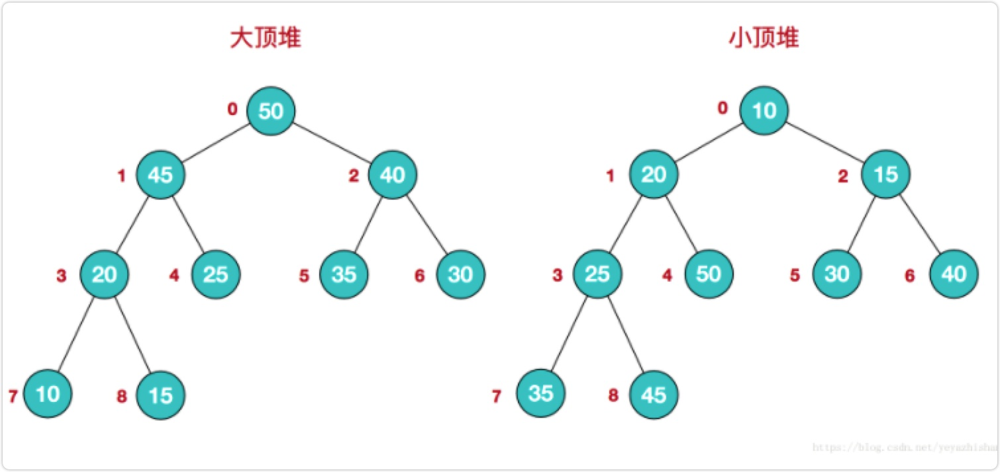

     平衡二叉树：

     **它是一棵空树或它的左右两个子树的高度差的绝对值不超过1，并且左右两个子树都是一棵平衡二叉树。**

     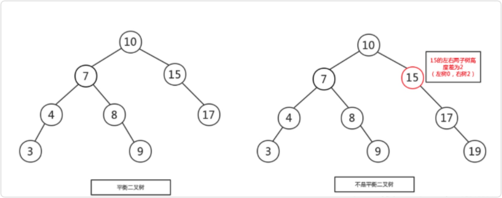

     二叉查找树：

     也称二叉搜索树，或二叉排序树。其定义也比较简单，要么是一颗空树，要么就是具有如下性质的二叉树：
  
     * 若任意节点的左子树不空，则左子树上所有结点的值均小于它的根结点的值；
     * 若任意节点的右子树不空，则右子树上所有结点的值均大于它的根结点的值；
   * 任意节点的左、右子树也分别为二叉查找树；
     * 没有键值相等的节点。

     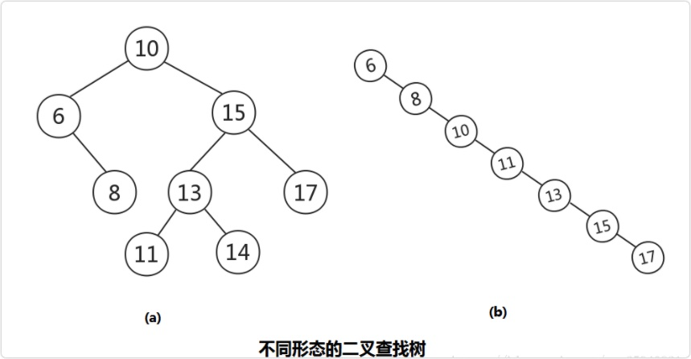

     红黑树：
  
     * 每个个节点或者是黑色，或者是红色。
   * 根节点是黑色。
     
     * 每个叶子节点（NIL）是黑色。 [注意：这里叶子节点，是指为空(NIL或NULL)的叶子节点！如果一个节点是红色的，则它的子节点必须是黑色的。
   * 从一个节点到该节点的子孙节点的所有路径上包含相同数目的黑节点。
  
   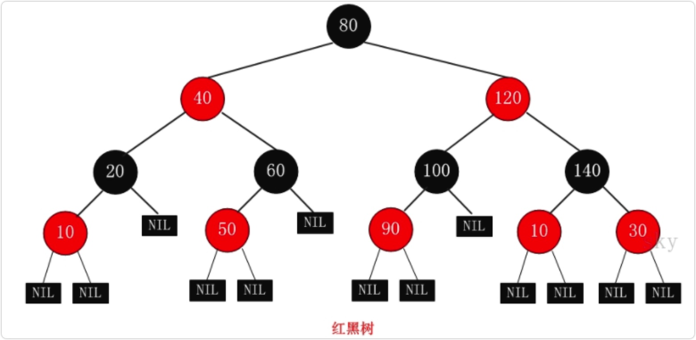
  
   b-树：b-树就是b树，不存在b减树的读法
  
   b树相对以二叉查找树的优点：减少了磁盘IO，索引树的高度表示了索引IO次数
  
   一个m阶的B树具有如下几个特征
  
   * 根结点至少有两个子女。
  
   * 每个中间节点都包含k-1个元素和k个孩子，其中 m/2 <= k <= m
     
     * 每一个叶子节点都包含k-1个元素，其中 m/2 <= k <= m
  
 * 所有的叶子结点都位于同一层。
     * 每个节点中的元素从小到大排列，节点当中k-1个元素正好是k个孩子包含的元素的值域分划。

     由于b树有众多条件限制，所以他是一个自平衡的树

     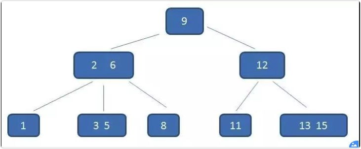

     b树的值域划分：
  
     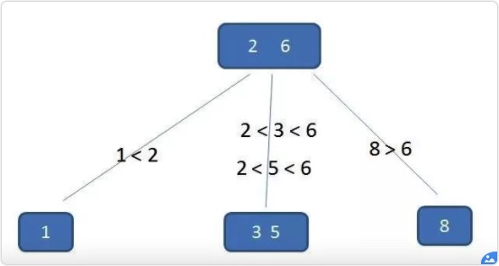
  
     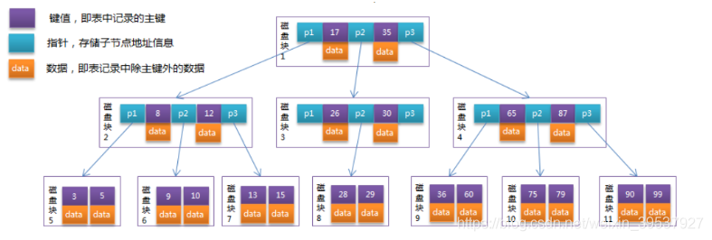
  
     b+树：
     
     * 有k个子树的中间节点包含有k个元素（B树中是k-1个元素），每个元素不保存数据，只用来索引，所有数据都保存在叶子节点。
     * 所有的叶子结点中包含了全部元素的信息，及指向含这些元素记录的指针，且叶子结点本身依关键字的大小自小而大顺序链接。
     * 所有的中间节点元素都同时存在于子节点，在子节点元素中是最大（或最小）元素。
     

  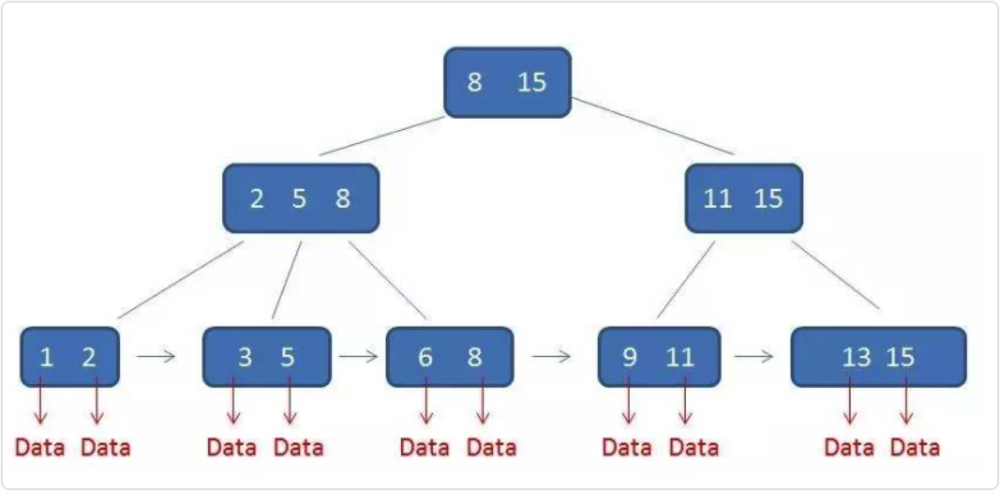


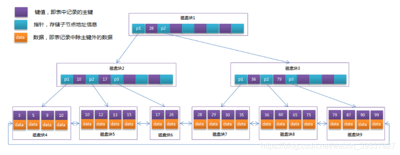     

B-树和B+树的区别：

  * b-树的每个节点包含数据、指针、关键字三个部分，每个节点对应着一个外存中的数据块，其中数据是指真实需要的数据，指针是指向子节点的指针，关键字是查找对象的比较目标。需要注意的是每个节点查找都需要读入内存，需要一次io操作，然后对于读入内存的数据再进行内存中的查找方法
    
  * 相对于b树b+树更加的'矮胖'，b+树中只在叶子节点保存了数据，非叶子节点都只包含关键字和指针，这种方式使得每个非叶子节点能包含更多的关键字信息，更加的减少磁盘IO次数。
    

  b+树除了叶子节点外，其他节点都不存储卫星数据，只存储索引数据。b树每个节点有索引又有卫星数据；卫星数据及索引对应的数据
     

     注：
     
     b+树怎么实现索引功能：
     
     https://blog.csdn.net/qq_26222859/article/details/80631121

  4. 散列表
  
     也叫哈希表，是根据关键码和值 (key和value) 直接进行访问的数据结构，通过key和value来映射到集合中的一个位置，这样就可以很快找到集合中的对应元素。
  
     HashMap，HashTable等，利用hash表的优势
  
     因为哈希表是基于数组衍生的数据结构，在添加删除元素方面是比较慢的，所以很多时候需要用到一种数组结合链表的一种结构
  
     jdk1.8之后才换成了数组加红黑树的结构
  
     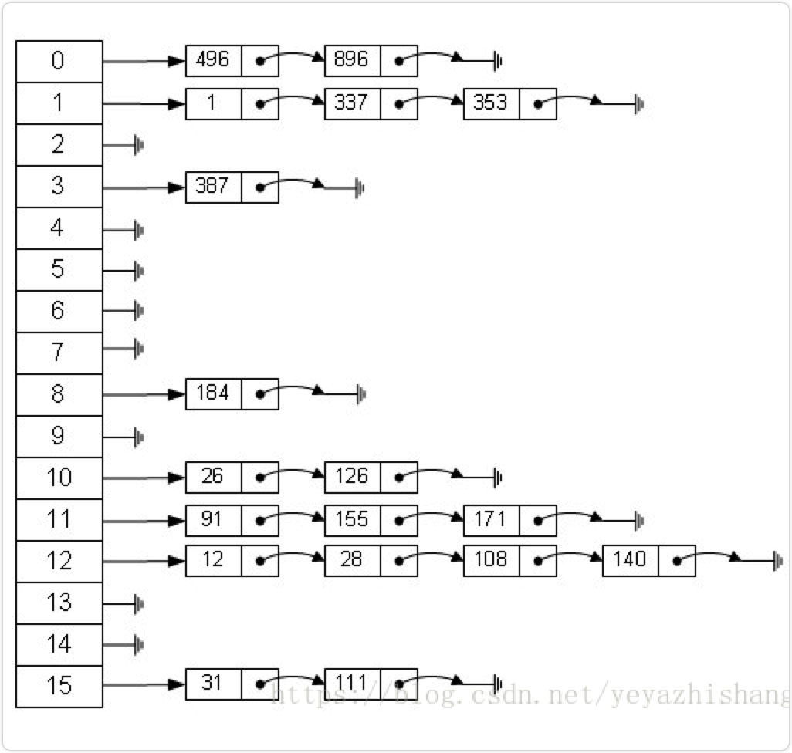
  
  5. 图性结构
  
     图是由结点的有穷集合V和边的集合E组成。其中，为了与树形结构加以区别，在图结构中常常将结点称为顶点，边是顶点的有序偶对，若两个顶点之间存在一条边，就表示这两个顶点具有相邻关系。
  
     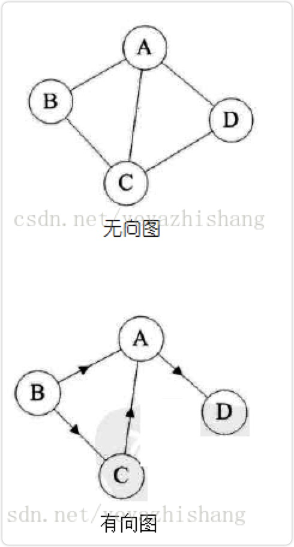

#### 基础数据结构的编码实现

**二叉树，前序后序的编码实现**

前中后序的遍历实际上根据根节点的输出顺序的命名。

一般根节点先输出即 根-左-右 为前序遍历，同样的 左-根-右为中序遍历，左-右-根为后序遍历

**树的深度和广度遍历是怎么样过程**


#### 简单集合类的代码底层原理

**HashMap：**

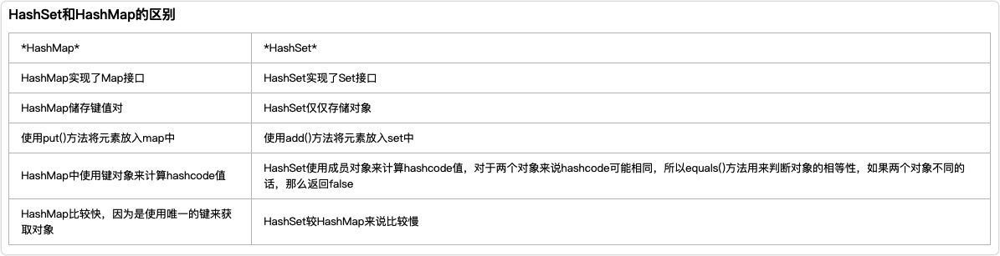

hashmap在put的时候，我们把每次put进入hashmap的数据称之为为entry，hashmap的所有键值对存储在一个数组中，这个数组是hashmap的主干，首先是通过hash函数算出put的k所存放的位置。因为数组初始化长度是有限的，如果通过hash函数和k计算出重复的entry存放位置，可以通过链表的形式存储。

同样get的时候，hash函数计算k所在位置，如果计算出的位置的entry的k符合即返回。不符合判断当前节点是否存在链表，有则链式查询。

hashmap的index的计算方式：**index = HashCode（Key） & （Length - 1）** （Length是HashMap的长度）

参考：[漫画：什么是HashMap？](https://mp.weixin.qq.com/s?__biz=MzIxMjE5MTE1Nw==&mid=2653191907&idx=1&sn=876860c5a9a6710ead5dd8de37403ffc&chksm=8c990c39bbee852f71c9dfc587fd70d10b0eab1cca17123c0a68bf1e16d46d71717712b91509&scene=21#wechat_redirect)

不允许重复的键

* JDK1.7及之前：数组+链表 

* JDK1.8：数组+链表+红黑树

  TreeMap：相对于Hashmap来说，Treemap一般是基于红黑树，且其按key的自然顺序或自定义顺序存储键值对

**HashSet:**

不允许重复的值；使用`Map`的Key存值,Value存放一个固定的Object

**ArrayList：**

它是基于数组实现的List类，它封装了一个Object[]类型的数组，长度可以动态的增长

**LinkedList:**

数组的地址是连续的，链表的地址是不连续的

双向链表的数据结构

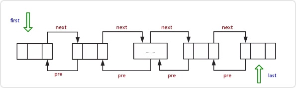

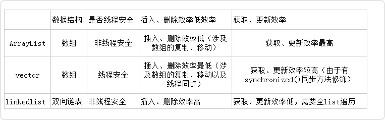

#### 常用集合类知识

**集合类分类**

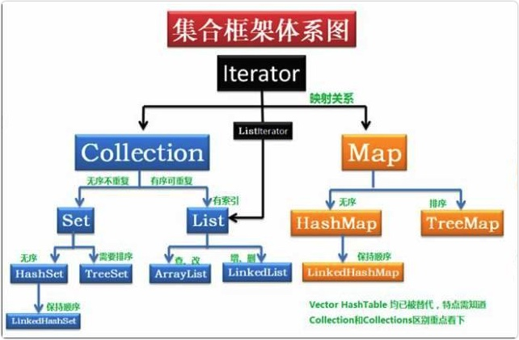

**List和Set的区别**

* list方法可以允许重复的对象，而set方法不允许重复对象
* list可以插入多个null元素，而set只允许插入一个null元素
* list是一个有序的容器，保持了每个元素的插入顺序。即输出顺序就是输入顺序，而set方法是无序容器，无法保证每个元素的存储顺序，TreeSet通过 Comparator 或者 Comparable 维护了一个排序顺序

list是一个有序的容器，保持了每个元素的插入顺序。即输出顺序就是输入顺序，而set方法是无序容器，无法保证每个元素的存储顺序，TreeSet通过 Comparator 或者 Comparable 维护了一个排序顺序

**HashSet和HashMap的区别**

1. HashSet和HashMap的区别，hashset的hash函数计算的val的hash函数，即hashset中没有相同的val。

   hashmap计算的是k的hash值

2. 本身属于不同的集合类，set属于集合类，map是k v

**Collection Collections的区别**

collection:它属于集合框架中的一个接口，并且是顶层接口。

 Collectios 则是在集合框架中给我们提供的一个工具类，它提供了一系列静态方法实现对各种集合的搜索、排序、线程安全化等操作。

#### 为什么hashMap的主干数组长度是2的倍数

其实在hashmap的使用长度超过负载因子时，hashmap会自动扩容。由于hash值太大不能拿来直接散列，所以要用hash值对数组长度取余操作，进一步放到数组下标里。数组下标的计算方法index = HashCode（Key） & （Length - 1）。 采用二进制位操作 &，如果长度不是2的幂次数，则通过 hash(key)&(length-1) 位运算得出的index冲突几率高。这就解释了 HashMap 的长度为什么是2的幂次方。

#### String、StringBuilder、StringBuffer

String：适用于少量的字符串操作的情况

StringBuilder：适用于单线程下在字符缓冲区进行大量操作的情况-线程不安全

StringBuffer：适用多线程下在字符缓冲区进行大量操作的情况-线程安全

#### 阻塞队列实现

* ArrayBlockingQueue

  基于数组实现的阻塞队列，初始化时需要定义数组的大小，也就是队列的大小，所以这个队列是一个**有界队列**

* LinkedBlockingQueue

  基于链表实现的阻塞队列，既然是链表，那么就可以看出这种阻塞队列含有链表的特性，那就是无界。但是实际上LinkedBlockingQueue是有界队列，默认大小是Integer的最大值，而也可以通过构造方法传入固定的capacity大小设置

可以看出LinkedBlockingQueue的属性和ArrayBlockingQueue的属性大致差不多，都是通过ReentrantLock和Condition来实现多线程之间的同步，而LinkedBlockingQueue却多了一个ReentrantLock，而不是入队和出队共用同一个锁

**那么为什么ArrayBlockingQueue只需要一个ReentrantLock而LinkedBlockingQueue需要两个ReentrantLock呢？**

ReentrantLock肯定是越多越好，锁越多那么相同锁的竞争就越少；LinkedBlockingQueue分别有入队锁和出队锁，所以入队和出队的时候不会有竞争锁的关系；而ArrayBlockingQueue只有一个Lock，那么不管是入队还是出队，都需要竞争同一个锁，所以效率会低点。ArrayBlockingQueue是环形数组结构，入队的地址和出队的地址可能是同一个，比如数组table大小为1，那么第一次入队和出队需要操作的位置都是table[0]这个元素，所以入队和出队必须共用同一把锁；而LinkedBlockingQueue是链表形式，内存地址是散列的，入队的元素地址和出队的元素地址永远不可能会是同一个地址。所以可以采用两个锁，分别对入队进行加锁同步和对出队进行加锁同步即可。

### 线程安全容器

线程安全：

HashTable，ConcurrentHashMap | Vector，CopyOnWrieArrayList，Collections.synchronizedList |     CopyOnWrieArraySet，Collections.synchronizedSet

不安全：

HashMap | ArrayList | HashSet

不安全会报：ConcurrentModificationException异常

分析异常原因：HashMap在put kv时，底层指令是先判断集合是否已满是否需要拓展，再put k再put v。

* 由于多线程调度关系，如果判断集合是否已满操作没有进行线程安全处理。可能有多个线程put 相同的k v（数据冗余）。

* 如果再put kv。操作没有进行线程安全处理,可能会出现数据丢失情况
* reHash的过程，可能会出现链表环，put操作会陷入死循环

arraylist 如何进行扩充，平衡二叉树原理和特点。

##### HashMap、Hashset、HashTable、ConcurrentHashMap 的原理和差异

指定初始容量，减少内存消耗

**hashmap**

* 初始容量为16，负载因子0.75
* 线程不安全，数组+链表，数组加红黑树，大于16*0.75自动扩容，在链表长度超过8，Node数组超过64时会将链表结构转换为红黑树
* index的计算是：hash(key) & (length -1)
* 可以时候null的key和value

**hashtable**

* Key value 不能为空，线程安全，修改时锁住了整个hashtable效率低
* 初始11size

**hashset**

* 以hashmap的key存放值，hashmap的value默认是空object对象
* 值不能重复，本身是set集合的

**concurrentHashMap**

* 使用锁分段的技术，将hashmap的主干数组分成了多段数据用segment[]存储，理论情况下支持n个进程进行并发操作

##### LinkedHashMap和hashMap

- LinkedHashMap是继承于HashMap，是基于HashMap和双向链表来实现的。
- HashMap无序；LinkedHashMap有序

### 网络原理

#### 正向代理、反向代理

正向代理是在客户端设置的，客户端先设置vpn转发地址，vpn转发到不同服务器

反向代理是在服务端设置，客户端无感知，客户端访问的是虚拟的ip端口，进行负载等功能，对客户端屏蔽服务端的信息

#### Netty框架

**Netty是一个高性能、异步事件驱动的NIO框架**，**它提供了对TCP、UDP和文件传输的支持**，作为一个异步NIO框架，Netty的所有IO操作都**是异步非阻塞**的，**通过Future-Listener机制，用户可以方便的主动获取或者通过通知机制获得IO操作结果**。

#### TCP三次握手、四次挥手

TCP 的三个特点：**面向连接、可靠性和面向字节流**。

SYN（Synchronize Sequence Numbers），同步序列编号；

ACK（Acknowledge Character），确认字符；

* 三次握手建立连接

  客户端：发送SYN连接包-第一次连接保证的是什么todo

  服务端：接受到SYN，发送SYN+ACK连接加确认包

  客户端：发送ACK确认包

* 四次挥手断开连接

  客户端：FIN断开连接包

  服务端：接受FIN断开包，发送ACK断开确认包

  服务端：发送FIN+ACK断开包（需要等正在发送的数据发送完成）

  客户端：接受FIN+ACK，发送ACK断开连接

#### HTTPS相对HTTP有啥好处

1. https有加密的过程，对通信内容加密，ssl\tls+http
2. https有验证报文的完整性

#### Tomcat支持的四种线程模型

|      | 描述                                                         |
| ---- | ------------------------------------------------------------ |
| BIO  | 阻塞式IO，采用传统的java IO进行操作，该模式下每个请求都会创建一个线程，适用于并发量小的场景 |
| NIO  | 同步非阻塞，比传统BIO能更好的支持大并发，tomcat 8.0 后默认采用该模式 |
| APR  | tomcat 以JNI形式调用http服务器的核心动态链接库来处理文件读取或网络传输操作，需要编译安装APR库 |
| AIO  | 异步非阻塞，tomcat8.0后支持                                  |

### 架构

#### 分布式和微服务区别

**分布式**

> 分布式的核心是**拆**，将一个完整的项目拆分为多个模块，并且将模块分开部署

分布式的项目拆分逻辑：水平拆分，垂直拆分

水平拆分：根据应用分层拆分思想拆分。例如经典的前后端分离架构。将应用拆分成3层架构，表示层(jsp\servlet\html)、业务逻辑层（service）、数据访问层（dao）。在分开部署。可以将表示层部署在服务器A，业务逻辑层和数据访问层部署在服务器B，通过网关等中间件进行服务通信。

垂直拆分：根据业务应用的功能进行拆分，比如电商项目，可以将电商项目拆分为订单项目，用户项目，秒杀项目。拆分后每个项目任然可以作为独立的项目运行。这种属于垂直拆分。

**微服务**

> 微服务字面上就是非常微小的服务，可以理解为粒度更加细的垂直划分

例如上面的电商项目中的订单项目，可以更加服务边界，进一步进行拆分为购物项目、结算项目、售后等。上述的订单项目可以作为一个分布式项目组成元素，但是不适合作为微服务的元素，因为订单项目本身还可以进行更小的服务拆分。

**总结**
分布式：拆了就行，对于服务边界的划分较为宽松

微服务：对于项目中的服务边界划分清晰。细粒度的拆分

### Spring框架

#### springcloud和dubbo的底层区别

* dubbo使用Netty这样的NIO框架，是基于TCP协议传输的，配合以Hession序列化完成RPC通信

  Dubbo 协议默认使用 Netty 作为基础通信组件，用于实现各进程节点之间的内部通信

* 而SpringCloud是基于Http协议+rest接口调用远程过程的通信，相对来说，Http请求会有更大的报文，占的带宽也会更多，使用的是JackSon处理JSON是序列化

Spring内部最核心的就是IOC了，动态注入，让一个对象的创建不用new了，可以自动的生产，这其实就是利用java里的反射，反射其实就是在运行时动态的去创建、调用对象，Spring就是在运行时，跟xml Spring的配置文件来动态的创建对象和调用对象里的方法的 。

Spring还有一个核心就是AOP面向切面编程，可以为某一类对象进行监督和控制（也就是在调用这类对象的具体方法的前后去调用你指定的模块）从而达到对一个模块扩充的功能。这些都是通过配置类达到的。

Spring目地就是让对象与对象（模块与模块）之间的关系没有通过代码来关联，都是通过配置类说明管理的

**RPC和HTTP的异同**

相同：

* 都是基于tcp协议的，远程服务调用

不同：

* rpc协议，要求通信双方要使用相同的rpc框架，因为不同的rpc可能使用的序列化方法不一样，不同的RPC协议，数据格式不一定相同

  需要关心通信中的细节，但是效率较高

* http协议，不需要通信双方都是相同的框架，只要满足http协议，满足restful原则既可以进行通信，一般请求数据格式使用json格式，不需要关注通信细节，http协议做了基本封装，但是消息较为臃肿，效率相对低

#### aop的底层实现

通过aop注解获取需要进行操作的类（类全路径），通过反射获取类内容，通过动态代理进行代理改类是方法执行，再其方法执行前后加上自定义方法

#### spring常用注解

##### @Transactional

参数：rollbackFor-指定异常回滚，noRollbackFor-指定异常不回滚

isolation-事务隔离级别（默认可重复读）

timeout-事务超时时间

**注：**

* @Transactional 只能被应用到public方法上, 对于其它非public的方法,如果标记了@Transactional也不会报错,但方法没有事务功能.

**为什么transactional只能用在public方法上**

在使用 Spring AOP 代理时，Spring 在调用在图 1中的 TransactionInterceptor 在目标方法执行前后进行拦截之前，DynamicAdvisedInterceptor（CglibAopProxy 的内部类）的的 intercept 方法或 JdkDynamicAopProxy 的 invoke 方法会间接调用 AbstractFallbackTransactionAttributeSource（Spring 通过这个类获取表 1.@Transactional 注解的事务属性配置属性信息）的 computeTransactionAttribute 方法

~~~java
protected TransactionAttribute computeTransactionAttribute(Method method, Class < ?>targetClass) {
    // Don't allow no-public methods as required.
    if (allowPublicMethodsOnly() && !Modifier.isPublic(method.getModifiers())) {
        return null;
    }
~~~

这个方法会检查目标方法的修饰符是不是 public，若不是 public，就不会获取 @Transactional 的属性配置信息，最终会造成不会用 TransactionInterceptor 来拦截该目标方法进行事务管理。

**事务失效的场景**

* 如果方法中有try{}catch(Exception e){}处理，**那么try里面的代码块就脱离了事务的管理，若要事务生效需要在catch中throw new RuntimeException ("xxxxxx")；这是可能存在的事务失效的场景。**

* **在@Transactional注解的方法中，再调用本类中的其他方法method2时，那么method2方法上的@Transactional注解是不！会！生！效！的！**

  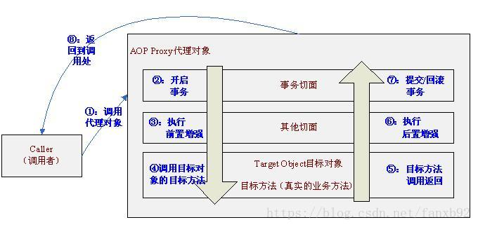**@Transactional注解通过AOP实现方式图解1**

  通过代理对象在目标对象前后进行方法增强，也就是事务的开启提交和回滚。那么继续调用本类中其他方法是怎样呢，如下图

  **@Transactional注解通过AOP实现方式图解2**

  可见目标对象内部的自我调用，也就是**通过this.指向的目标对象将不会执行方法的增强。**
  
  **避免 Spring 的 AOP 的自调用问题，必须要跨service调用**

**事务的传播行为**

* @Transactional(propagation=Propagation.REQUIRED)：默认的spring事务传播级别，使用该级别的特点是，如果上下文中已经存在事务，那么就加入到事务中执行，如果当前上下文中不存在事务，则新建事务执行，所以这个级别通常能满足处理大多数的业务场景。
* @Transactional(propagation=PROPAGATION.SUPPORTS)：从字面意思就知道，supports(支持)，该传播级别的特点是，如果上下文存在事务，则支持当前事务，加入到事务执行，如果没有事务，则使用非事务的方式执行。所以说，并非所有的包在transactionTemplate.execute中的代码都会有事务支持。这个通常是用来处理那些并非原子性的非核心业务逻辑操作，应用场景较少。
* @Transactional(propagation=PROPAGATION.MANDATORY)：该级别的事务要求上下文中必须要存在事务，否则就会抛出异常！配置该方式的传播级别是有效的控制上下文调用代码遗漏添加事务控制的保证手段。比如一段代码不能单独被调用执行，但是一旦被调用，就必须有事务包含的情况，就可以使用这个传播级别。
* @Transactional(propagation=PROPAGATION.REQUIRES_NEW)：从字面即可知道，每次都要一个新的事务，该传播级别的特点是，每次都会新建一个事务，并且同时将上下文中的事务挂起，当新建事务执行完成以后，上下文事务再恢复执行。
  这是一个很有用的传播级别，举一个应用场景：现在有一个发送100个红包的操作，在发送之前，要做一些系统的初始化、验证、数据记录操作，然后发送100封红包，然后再记录发送日志，发送日志要求100%的准确，如果日志不准确，那么整个父事务逻辑需要回滚。
  怎么处理整个业务需求呢？就是通过这个PROPAGATION.REQUIRES_NEW 级别的事务传播控制就可以完成。发送红包的子事务不会直接影响到父事务的提交和回滚。
* @Transactional(propagation=PROPAGATION.NOT_SUPPORTED) ：这个也可以从字面得知，not supported(不支持)，当前级别的特点是,如果上下文中存在事务，
  则挂起事务，执行当前逻辑，结束后恢复上下文的事务。
  这个级别有什么好处？可以帮助你将事务极可能的缩小。我们知道一个事务越大，它存在的风险也就越多。所以在处理事务的过程中，要保证尽可能的缩小范围。比如一段代码，是每次逻辑操作都必须调用的，比如循环1000次的某个非核心业务逻辑操作。这样的代码如果包在事务中，势必造成事务太大，导致出现一些难以考虑周全的异常情况。所以这个事务这个级别的传播级别就派上用场了，用当前级别的事务模板抱起来就可以了。
* @Transactional(propagation=PROPAGATION.NEVER)：该事务更严格，上面一个事务传播级别只是不支持而已，有事务就挂起，而PROPAGATION_NEVER传播级别要求上下文中不能存在事务，一旦有事务，就抛出runtime异常，强制停止执行！
* @Transactional(propagation=PROPAGATION.NESTED)：字面也可知道，nested，嵌套级别事务。该传播级别特征是，如果上下文中存在事务，则嵌套事务执行，如果不存在事务，则新建事务。
  那么什么是嵌套事务呢？

##### @Autowired和@Resource的区别

* 所在的jar包不一样，autowried在spring的包，Resource在jdk1.6后的原生包
* autowried是按照type去匹配对象的，resource是按照name去匹配对象的
* autowried默认不允许空

##### @bean\@controller\@restcontroller

#### spring的类加载过程

1. 加载-所有的bean已经被扫描加载到applicationcontext中
2. 解析-使用getBean或者注解通过beanname或者beantype解析要加载的bean
3. 合并继承-合并父类子类的bean定义信息
4. 实例化-bean的实例化方法执行，创建bean实例
5. 初始化-初始化方法调用，属性填充
6. 获得最终的实例bean

#### spring中bean生命周期

1. bean创建
2. bean注入
   1. 注入前的afterpropertieset方法
   2. 调整init-method方法
3. bean使用
4. bean销毁
   1. destroy方法
   2. destroy-method方法

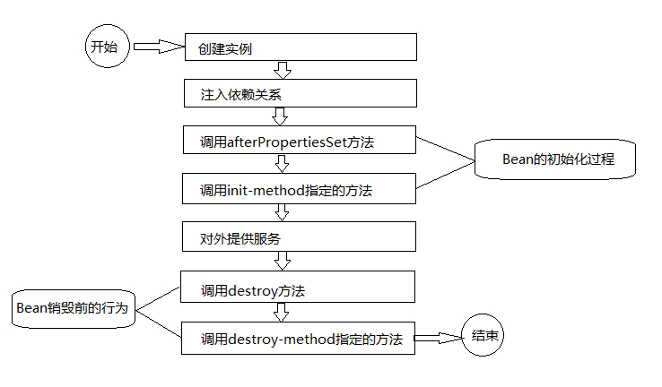

#### Spring常用的接口和类

* ApplicationContextAware

  获取ApplicationContext，获取容器中的上下文对象，包括实体bean之类。

* ApplicationListener接口

   需要监听自定义事件时，可以新建一个实现ApplicationListener接口的类，并将该类配置到Spring容器中

  ~~~java
  /** 
   * 自定义事件监听器 
   */  
  public class CustomEventListener implements ApplicationListener {  
      public void onApplicationEvent(ApplicationEvent event) {  
          if(event instanceof AnimalEvent){  
              AnimalEvent animalEvent = (AnimalEvent)event;  
              System.out.println("触发自定义事件：Animal name is " + animalEvent.getName());  
          }  
      }  
  }  
  ~~~

* initializingBean接口

     当需要在bean的全部属性设置成功后做些特殊的处理，可以让该bean实现InitializingBean接口。
     效果等同于bean的init-method属性的使用或者@PostContsuct注解的使用。
     三种方式的执行顺序：先注解，然后执行InitializingBean接口中定义的方法，最后执行init-method属性指定的方法

* DisposableBean接口
     当需要在bean销毁之前做些特殊的处理，可以让该bean实现DisposableBean接口。
     效果等同于bean的destroy-method属性的使用或者@PreDestory注解的使用。
     三种方式的执行顺序：先注解，然后执行DisposableBean接口中定义的方法，最后执行destroy-method属性指定的方法。

### 线程

#### 线程新建

继承Thread类，调用start()方法
实现Runnable接口，重写run()方法，调用start()方法

此处注意，无论哪种启动线程时都是调用start()方法

**start(）方法，直接调用run()方法可以达到多线程的目的通常，系统通过调用线程类的start()方法来启动一个线程，此时该线程处于就绪状态，而非运行状态，这也就意味着这个线程可以被JVM来调度执行。在调度过程中，JVM会通过调用线程类的run()方法来完成试机的操作，当run()方法结束之后，此线程就会终止**

**run()和start()的区别可以用一句话概括：单独调用run()方法，是同步执行；通过start()调用run()，是异步执行。**

如果直接调用run方法，那多线程并发异步执行的意义就不大了； 除非有特殊的业务场景需求

#### 线程状态

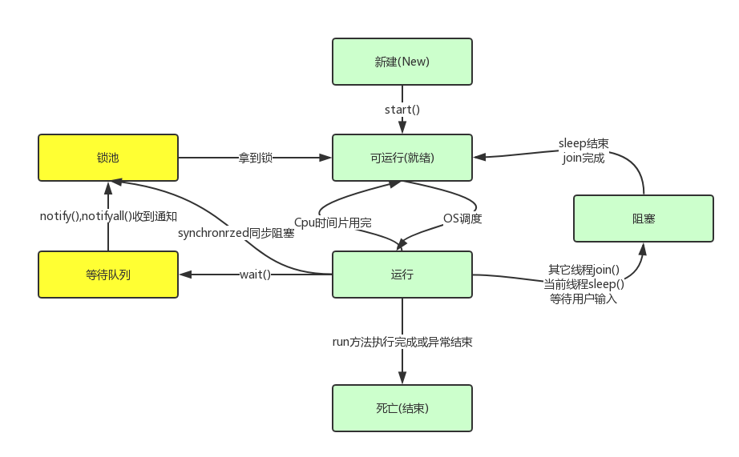

#### 线程池

一个线程池包括以下四个基本组成部分：

* 线程池管理器（ThreadPool）：用于创建并管理线程池，包括 创建线程池，销毁线程池，添加新任务；
* 工作线程（WorkThread）：线程池中线程，在没有任务时处于等待状态，可以循环的执行任务；
* 任务接口（Task）：每个任务必须实现的接口，以供工作线程调度任务的执行，它主要规定了任务的入口，任务执行完后的收尾工作，任务的执行状态等；
* 任务队列（TaskQueue）：用于存放没有处理的任务。提供一种缓冲机制。

1. 线程池的几种不同的创建方法

   * JDK 1.8使用Executor创建线程池实例。提供了多种方式的创建线程池的实例，newCachedThreadPool(...)、newFixedThreadPool(...)、newSingleThreadExecutor、newScheduledThreadPool等，其底层使用的是ThreadPoolExecutor，只不过Executor提供几种默认参数的ThreadPoolExecutor实现类。一般情况下，建议使用ThreadPoolExecutor，根据业务情况手动配置参数

     ~~~java
     //提供了默认参数的
     ExecutorService executor = Executors.newFixedThreadPool(3);
             ThreadDemoByRunnable task = new ThreadDemoByRunnable("测试");
             int count = 3;
             while (count > 0) {
                 executor.execute(task);
                 count--;
             }
             Thread.sleep(100);
             task.running = false;
             ThreadDaemon timer = new ThreadDaemon();
             timer.setDaemon(true);
     
             executor.execute(timer);
             executor.shutdownNow();
     //全部参数
     ThreadPoolExecutor tpe = new ThreadPoolExecutor(5, 10, 100, MILLISECONDS, new ArrayBlockingQueue<Runnable>(5));
     for (int i = 0; i < 13; i++) {
     	pool.execute(new ThreadTaskByRunnable("Task" + i));
     }
     pool.shutdown();
     ~~~

     * newCachedThreadPool创建一个可缓存线程池，如果线程池长度超过处理需要，可灵活回收空闲线程，若无可回收，则新建线程。

     * newFixedThreadPool 创建一个定长线程池，可控制线程最大并发数，超出的线程会在队列中等待。

     * newScheduledThreadPool 创建一个定长线程池，支持定时及周期性任务执行。

     * newSingleThreadExecutor 创建一个单线程化的线程池，它只会用唯一的工作线程来执行任务，保证所有任务按照指定顺序(FIFO, LIFO, 优先级)执行

   * 自定义线程线程池配置参数详情

     **Todo important** 线程的一些常用参数配置
     
     **corePoolSize： 线程池维护线程的最少数量
     maximumPoolSize：线程池维护线程的最大数量
     keepAliveTime： 线程池维护线程所允许的空闲时间**（解释：当线程池的数量超过corePoolSize时，多余的空闲线程的存活时间。）
     **unit： 线程池维护线程所允许的空闲时间的单位
     workQueue： 线程池所使用的缓冲队列
     handler： 线程池对拒绝任务的处理策略**

2. 好处

   * 降低资源消耗：减少频繁的开启创建线程的时间和性能消耗
   * 提高性能：不用手动创建线程，从线程池取即可，
   * 增强系统的稳定性：线程是系统稀缺资源，统一的线程池管理有利于提供系统稳定性，方便统一管理和维护调优

3. 缺点

   * 线程池初始化时时间消耗较大
   * 线程池的使用较为复杂，需要谨慎调优，使用不当可能会触发系统异常
   * 线程池中线程优先级无法自定义调整

4. ThreadLocal

   * 用途：线程变量副本，每个线程用于自己的变量副本，相互不影响
* 内存泄漏问题，线程强引用，不会被GC。使用完线程共享变量后，显示调用ThreadLocalMap.remove方法清除线程共享变量，让JVM自动GC

**如何实现的多线程并发-具体步骤**

1. List集合里面存储的是要执行的任务runable的实现
2. concurrentHashMap存放执行结果
3. 循环List任务集合，使用CompletableFuture的runAsync方法，从jdk的默认线程池里面取线程执行任务，结果放入concurrentHashMap

### 线程安全

#### 锁

**公平/非公平**

```
* 公平/非公平锁FairSync
* 公平锁：多个线程按照申请锁的顺序来获取锁
* 非公平锁：多个线程获取锁的顺序并不是按照申请锁的顺序，有可能后申请的线程比先申请的线程
* 优先获取锁，可能会出现优先级反转，或者是饥饿现象（可能存在线程一直获取不到锁）
```

**可重入锁（递归锁）**

```
* 可重入锁(递归锁) ReentrantLock
* 线程可以进入任何一个已经获取锁的，正在同步的代码块
```

**自旋锁**

```
* 通过while循环，不断重试，实际没加锁（即代码无lock类）
* 基于CAS compareAndSet
```

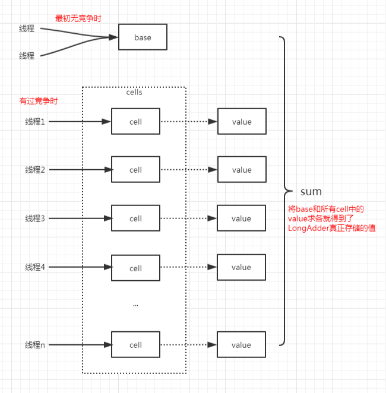

AtomicLong中有个内部变量value保存着实际的long值，所有的操作都是针对该变量进行。也就是说，高并发环境下，value变量其实是一个热点，也就是N个线程竞争一个热点。

LongAdder的基本思路就是分散热点，将value值分散到一个数组中，不同线程会命中到数组的不同槽中，各个线程只对自己槽中的那个值进行CAS操作。

这样热点就被分散了，冲突的概率就小很多。如果要获取真正的long值，只要将各个槽中的变量值累加返回。

AtomicLong是多个线程针对单个热点值value进行原子操作。而LongAdder是每个线程拥有自己的槽，各个线程一般只对自己槽中的那个值进行CAS操作。

**读写锁**

```
* 读写锁 ReentrantReadWriteLock
* <p>
* 多个线程同时读一个资源类，没有任何问题，为了满足并发量，读取共享资源可以同时进行
* 但是
* 如果有一个线程想写共享资源类，就不应该再有其他线程可以对该资源类进行读或者写
* 即：
* 读-读 共存
* 读-写 不共存
* 写—写 不共存
* 写操作：原子独占，不可中断
* <p>
* A\B原则
* before使用该技术前
* after使用技术后
```

**乐观锁悲观锁**

[参考](https://www.jianshu.com/p/d2ac26ca6525)

乐观锁适合读多写少的场景。悲观锁适合读少写多的场景

*悲观锁：*

悲观锁具有强烈的独占和排他性，每次读取数据都假设最坏的情况，默认认为其他线程会更改数据，因此需要进行加锁操作。当其他线程进行访问时，需要堵塞挂起。

悲观锁的实现有传统关系型数据库中的行锁、表锁、读锁、写锁，java里面的synchronized关键字的实现

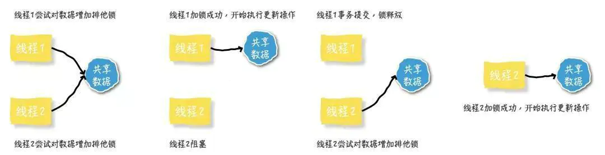

悲观锁又分为：共享锁，排他锁

共享锁：多个事务线程可以同时共享一把锁，都能访问数据，但是只能读，又被称为读锁

排他锁：不和其他事务线程共享锁，独占锁，仅仅拥有锁的线程可以进行读写操作

*乐观锁：*

乐观锁假设数据一般不会造成冲突，一般只有在用户进行更新提交时，才会校验数据是否有冲突，如果有冲突，返回错误信息给用户决定如何操作

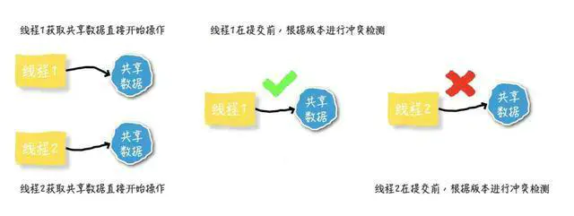

乐观锁本身不会刻意使用数据库的锁机制，依赖的是数据本身来保证数据的真确性，	

乐观锁的常见实现：

cas自旋锁：自旋锁在每次进行数据更新是，会重新从主内存取最新的值和当前要修改的值做比对，一致时才进行修改，不一致时，重新自旋取值比较。

自旋锁的ABA问题：使用版本号控制修改记录。每次数据修改version+1，再对比修改前版本写入，如果版本不相等，重新读取更新

#### sychronize和Reentrantlock区别

AQS: abstractQueuedSynchronizer 抽象队列同步器

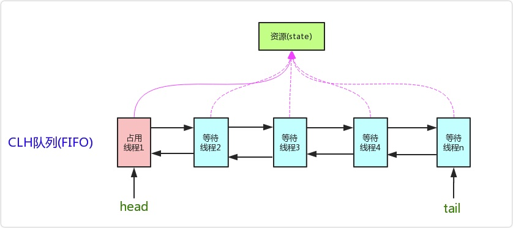

sychronize：

* 属于jvm层面的锁，底层是用的jvm的monitor
* 避免死锁，反编译后可以发现其每次都有两次的锁释放。
* 不需要手动释放锁
* 执行过程不可中断
* 非公平锁，可重入锁

Reentrantlock：

* 属于java.util.concurrent包，属于api层面的锁
* 需要手动释放锁，可能会出现死锁
* 执行过程可中断
* 公平和非公平都支持，
* 支持锁绑定多个条件condition，实现线程的部分和精准唤醒

在Java中Lock接口比synchronized块的优势是什么？你需要实现一个高效的缓存，它允许多个用户读，但只允许一个用户写，以此来保持它的完整性，你会怎样去实现它？

~~~java
//使用读写锁ReentrantReadWriteLock
public class Demo{
  public static void main(String[] args){
    Mycache mycache = new Mycache();
    for(i=0;i<10;i++){
      final int finalI = i;
      new Thread(()->{
        mycache.put(i+"",i);
      },"thread-test").start();
    }
  }
}

calss MyCache{
	private volatile Map<String,Obejct> cacheMap = new HashTable<>();
  private ReentrantReadWriteLock rwLock = new ReentrantReadWriteLock();
  public void put(String k,Object v){
    rwLock.writeLock().lock();
    try{
      cacheMap.put(k,v)
    }catch(Exception e){
      e.printstackTrace()
    }finally{
      rwLock.writeLock().lock();
    }
  }
  public Object void get(String k){
    rwLock.readLock().lock();
    try{
      cacheMap.get(k);
    }catch(Exception){
      e.printStackTrace();
    }finally{
      rwLock.readLock.unlock();
    }
  }
}
~~~

#### 阻塞同步、非阻塞同步

阻塞\非阻塞：程序在等待调用结果时的状态

阻塞：在未返回调用结果前，当前线程会被挂起，只有调用返回数据时，线程才会继续执行

非阻塞：线程在接口调用时，不能立即得到结果，不会阻止线程。会通过其他方法，类似轮训，异步通知等操作获取调用结果

同步\异步：消息通信机制

同步：在发出一个*调用*时，在没有得到结果之前，该*调用*就不返回。但是一旦调用返回，就得到返回值了

异步：发出一个调用时，立即返回，只是返回是否调用成功，调用者不会立刻得到调用结果。*被调用者*(类似接口)通过状态、通知来通知调用者，或通过回调函数处理这个调用结果。

### 中间件

#### zookeeper

##### 节点类型

1. 持久节点(PERSISTENT)

持久节点，创建后一直存在，直到主动删除此节点。

2. 持久顺序节点(PERSISTENT_SEQUENTIAL)

持久顺序节点，创建后一直存在，直到主动删除此节点。在ZK中，每个父节点会为它的第一级子节点维护一份时序，记录每个子节点创建的先后顺序。

3. 临时节点(EPHEMERAL)

临时节点在客户端会话失效后节点自动清除。临时节点下面不能创建子节点。

4. 顺序临时节点(EPHEMERAL_SEQUENTIAL)

临时节点在客户端会话失效后节点自动清除。临时节点下面不能创建子节点。父节点getChildren会获得顺序的节点列表。

#### rabbitmq

todoΩ

默认情况下，RbbitMQ 的消息默认存放在内存上面，如果不特别声明设置，消息不会持久化保存到硬盘上面的，如果节点重启或者意外crash掉，消息就会丢失。RabbitMQ分发完消息后，也会从内存中把消息删除掉。

##### 消息丢失问题：

**消息丢失的原因**

1. 生产者生成消息，发送过程丢失

   * 网络原因，发送过程丢包导致服务端接受不到信息
   * 代码层面，代码逻辑处理不当，导致信息丢失

   > 如何保证不丢失

   * AMQP协议提供的了**事务机制**，由于同步操作，但是会大大降低性能（不推荐）

   * **发送方确认机制**（publisher confirm）

     * 串行confirm模式：producer每发送一条消息后，调用waitForConfirms()方法，等待broker端confirm，如果服务器端返回false或者在超时时间内未返回，客户端进行消息重传。

     * 批量confirm模式：producer每发送一批消息后，调用waitForConfirms()方法，等待broker端confirm。

     * 异步confirm模式：提供一个回调方法，broker confirm了一条或者多条消息后producer端会回调这个方法。

1. 消息队列存储消息丢失，或者可靠性不足

   * 消息未持久化直接宕机
   * 多节点中，某一个节点宕机

   > 如何保证不丢失

   * **多节点同步机制**，保证消息持久化
   * **消息有效标志**，提供可靠性标志

2. 消息队列到消费者丢失

   * 此时消息如果处理不当会有丢失风险，后面会讲到如何处理这个情况，消费端也有ack机制

   > 如何保证不丢失

   * **接收方确认机制**消费者取到消息后，从消息中取出唯一标识，先**判断此消息有没有被消费过，若已消费过，则直接ACK(避免重复消费**) ，正常处理成功后，将生产者Redis中的此消息删除，并ACK(告诉server端此消息已成功消费)
   * **消费异常重试机制**。遇到异常时，捕获异常，验证自己在消息中设定的重试次数是否超过阀值，若超过，则放入死信队列，若未超过，则向将消息中的重试次数加1，抛出自定义异常，进入重试机制。多次未成功消费，持久化入表，**人工进行消息补偿措施**

**rabbitmq、 rocketmq、kakaf的区别**

todo

#### redis应用场景

##### redis数据结构

string、hash：hashTable、list：ziplist\LinkedList、sets、sortedSets

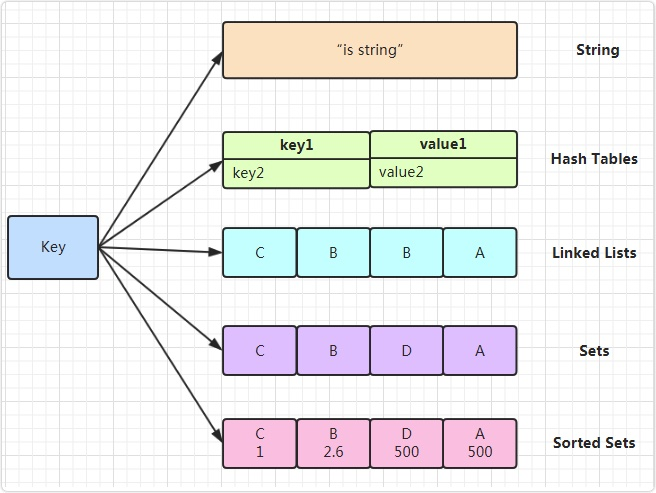

##### 缓存穿透和缓存雪崩问题

**缓存穿透：**即黑客故意去请求缓存中不存在的数据，导致所有的请求都怼到数据库上，从而数据库连接异常。

**缓存雪崩：**即缓存同一时间大面积的失效，这个时候又来了一波请求，结果请求都怼到数据库上，从而导致数据库连接异常。

临时token、短信通知

##### redis如何进行持久化存储

> Redis提供了RDB和AOF两种不同的数据持久化方式

2种模式都开启使用的AOF模式

**RDB(Redis DataBase)**

在不同的时间点，将redis存储的数据生成快照并存储到磁盘等介质上。默认保存的文件名为dump.rdb

无论是由主进程生成还是子进程来生成，其过程如下：

- 生成临时rdb文件，并写入数据。
- 完成数据写入，用临时文代替代正式rdb文件。
- 删除原来的db文件。

DB默认生成的文件名为dump.rdb，当然，我可以通过配置文件进行更加详细配置，比如在单机下启动多个redis服务器进程时，可以通过端口号配置不同的rdb名称，如下所示：

```shell
# 是否压缩rdb文件
rdbcompression yes

# rdb文件的名称
dbfilename redis-6379.rdb

# rdb文件保存目录
dir ~/redis/
```

两种方式触发RDB模式的持久化

* 使用的save、bgsave命令手动触发。save命令执行时主进程会同步阻塞，bgsave命令执行时主线程会fork一个子进程来进行数据同步，主进程不会堵塞但是子进程依旧堵塞，子进程IO写入dump.rdb文件完成后会退出。

  ~~~shell
  # 同步数据到磁盘上
  > save 
  # 异步保存数据集到磁盘上
  > bgsave
  ~~~

* 使用redis配置文件，指定RDB持久化触发的的条件，比如【多少秒内至少达到多少写操作】就开启RDB数据同步。

  ~~~shell
  # 900s内至少达到一条写命令
  save 900 1
  # 300s内至少达至10条写命令
  save 300 10
  # 60s内至少达到10000条写命令
  save 60 10000
  ~~~

  之后在启动服务器时加载配置文件。

  ```shell
  # 启动服务器加载配置文件
  redis-server redis.conf
  ```

  这种配置文件触发，和bgsave命令类似。使用子进程同步。弊端是如果设置陈触发时间太短，容易频繁的写入rdb文件，影响redis性能，设置的时间太长会导致数据丢失

**AOF(Append Only File)**

> AOF持久化方式会记录客户端对服务器的每一次写操作命令，并将这些写操作以Redis协议追加保存到以后缀为aof文件末尾，在Redis服务器重启时，会加载并运行aof文件的命令，以达到恢复数据的目的。

3种AOF的文件写入策略

* always

  客户端的每一个写操作都保存到aof文件当，这种策略很安全，但是每个写请注都有IO操作，所以也很慢。

* everysec

  appendfsync的默认写入策略，每秒写入一次aof文件，因此，最多可能会丢失1s的数据。

* no

  Redis服务器不负责写入aof，而是交由操作系统来处理什么时候写入aof文件。更快，但也是最不安全的选择，不推荐使用。

**RDB和AOF的优缺点**

* RDB由于同步时间问题，可能会出现数据丢失。AOF如果合理的设置同步策略基本不会出现丢失数据的问题

* RDB和AOF同时使用时，使用AOF文件，因为AOF的记录信息更多文件体积，相对的恢复速度较慢，但是

  数据完整性较高

##### Redis Sentinel机制与用法

> Redis-Sentinel是Redis官方推荐的高可用性(HA)解决方案，当用Redis做Master-slave的高可用方案时，假如master宕机了，Redis本身(包括它的很多客户端)都没有实现自动进行主备切换，而Redis-sentinel本身也是一个独立运行的进程，它能监控多个master-slave集群，发现master宕机后能进行自懂切换。
>
> 同时redis-sentinel本身也是需要集群的

todo

### sql索引以及数据库

#### 数据库设计3大范式

**第一范式(确保每列保持原子性)**

第一范式是最基本的范式。如果数据库表中的所有字段值都是不可分解的原子值，就说明该数据库表满足了第一范式。

第一范式的合理遵循需要根据系统的实际需求来定。比如某些数据库系统中需要用到“地址”这个属性，本来直接将“地址”属性设计成一个数据库表的字段就行。但是如果系统经常会访问“地址”属性中的“城市”部分，那么就非要将“地址”这个属性重新拆分为省份、城市、详细地址等多个部分进行存储，这样在对地址中某一部分操作的时候将非常方便。这样设计才算满足了数据库的第一范式，如下表所示。


上表所示的用户信息遵循了第一范式的要求，这样在对用户使用城市进行分类的时候就非常方便，也提高了数据库的性能。

**第二范式(确保表中的每列都和主键相关)**

第二范式在第一范式的基础之上更进一层。第二范式需要确保数据库表中的每一列都和主键相关，而不能只与主键的某一部分相关（主要针对联合主键而言）。也就是说在一个数据库表中，一个表中只能保存一种数据，不可以把多种数据保存在同一张数据库表中。

比如要设计一个订单信息表，因为订单中可能会有多种商品，所以要将订单编号和商品编号作为数据库表的联合主键，如下表所示。

 **订单信息表**


这样就产生一个问题：这个表中是以订单编号和商品编号作为联合主键。这样在该表中商品名称、单位、商品价格等信息不与该表的主键相关，而仅仅是与商品编号相关。所以在这里违反了第二范式的设计原则。

而如果把这个订单信息表进行拆分，把商品信息分离到另一个表中，把订单项目表也分离到另一个表中，就非常完美了。如下所示。


这样设计，在很大程度上减小了数据库的冗余。如果要获取订单的商品信息，使用商品编号到商品信息表中查询即可。

**第三范式(确保每列都和主键列直接相关,而不是间接相关)**

第三范式需要确保数据表中的每一列数据都和主键直接相关，而不能间接相关。

比如在设计一个订单数据表的时候，可以将客户编号作为一个外键和订单表建立相应的关系。而不可以在订单表中添加关于客户其它信息（比如姓名、所属公司等）的字段。如下面这两个表所示的设计就是一个满足第三范式的数据库表。


这样在查询订单信息的时候，就可以使用客户编号来引用客户信息表中的记录，也不必在订单信息表中多次输入客户信息的内容，减小了数据冗余。

#### sql锁表

在使用SQL时，大都会遇到这样的问题，update一条记录时，需要通过Select来检索出其值或条件，然后在通过这个值来执行修改操作。

但当以上操作放到多线程中并发处理时会出现问题：某线程*select*了一条记录但还没来得及*update*时，另一个线程仍然可能会进来*select*到同一条记录

**一般解决办法就是使用锁和事务的联合机制：**

mysql> select k from t where id=1 lock in share mode; #乐观锁（s锁，共享锁），可读

mysql> select k from t where id=1 for update; #悲观锁，排他锁

乐观锁（默认值）：读取数据时不锁，更新时检查是否数据已经被更新过，如果是则取消当前更新，一般在悲观锁的等待时间过长而不能接受时我们才会选择乐观锁。

悲观锁：在读取数据时锁住那几行，其他对这几行的更新需要等到悲观锁结束时才能继续 。

注:for update 仅适用于InnoDB，并且必须开启事务，在begin与commit之间才生效。

#### 索引类别

非聚集索引:

**该索引中索引的逻辑顺序与磁盘上行的物理存储顺序不同，一个表中可以拥有多个非聚集索引。**

> 唯一索引：值唯一，允许空值null
>
> 普通索引：允许重复和空值、仅加速查询
>
> 单列索引：一个索引只包括单个列

聚集索引：

**数据行的物理顺序与列值的顺序相同**

> 主键索引：唯一且不能为空，不能null

组合索引：在多个列字段上面创建索引，使用组合索引时，遵循最左前缀集合。即（field1，field2，field3）的组合索引，是安装从左到右匹配索引的

#### 索引值改变了，树的结构如何改变

#### sql优化

1. 数据库查询、优化方法，sql常用函数，存储过程

   1. 优化方法

      * 关注耗时的读写是否走了索引，避免进行全表扫描

      * 避免使用selet *，查询时指定返回的具体字段

      * 使用varchar/nvarchar 代替 char/nchar

        以varchar(10)和char(10)存储3个字符长度的数据举例。varchar数据占用空间为3，最大为10；char占用的为10，3个实际字符和7个空字符

      * 索引的底层实现

   2. sql常用函数、以oracle为例

      * Avg()返回平均值，sum()返回总和
      * count()返回行数
      * MAX()、MIN() 返回列最大和最小值
      * Upper()、lower()大小写转化

   3. 存储过程是在大型数据库系统中，一组为了完成特定功能的SQL语句集，存储在数据库中，一次编译永久有效，可通过调用语句进行复用。

      **把SQL语句进行封装，并且可以使用简单的语句进行调用，这样就可以不用重复写一样的SQL，提高工作效率。**
   
2. 查看sql执行计划，查看是否全表扫描，是否走了索引

3. 查看dump文件，是否有线程堵塞和锁住

4. oracle数据库的awr文件

   1. 热块效应
   2. 反向索引

#### 手写sql语句

5000万条数据，在500ms毫秒之内

1. 减少函数运算
2. 更改where后的条件先后排序
3. 给表添加索引

* 两个引擎

  * mysql 

    对数据库ACID事务的支持。并且还提供了行级锁和外键的约束。它的设计的目标就是处理大数据容量的数据库系统。

    不支持全文搜索的。同时，启动也比较的慢，它是不会保存表的行数的。锁的力度小，写操作等不会锁全表

    启动也比较的慢，它是不会保存表的行数的

  * MyIASM引擎

    不提供事务的支持，也不支持行级锁和外键

    MyIASM引擎是保存了表的行数，写操作锁全表。读效率高

  * B+树数据库引擎的底层实现

    b树：多叉树、节点支持存储多个数据

* 什么情况加索引无效

  * 如果条件中有or，即使其中有条件带索引也不会使用(这也是为什么尽量少用or的原因)

    注意：要想使用or，又想让索引生效，只能将or条件中的每个列都加上索引

  * 对索引进行了运算会导致查询不走索引，会使用全表扫描

  * 如果列类型是字符串，那一定要在条件中将数据使用引号引用起来,否则不使用索引

  * like查询是以%开头。like "AMS%"是支持的

  * 多列索引，不按照列索引顺序查询
  
    ```
    多个索引：
    INDEX name (last_name),  
    INDEX_2 name (first_name) 
    多列索引：
    INDEX name (last_name,first_name)  
    
    生效：
    SELECT * FROM test WHERE last_name='Kun' AND first_name='Li';
    sql会先过滤出last_name符合条件的记录，在其基础上在过滤first_name符合条件的记录。那如果我们分别在last_name和first_name上创建两个列索引，mysql的处理方式就不一样了，它会选择一个最严格的索引来进行检索，可以理解为检索能力最强的那个索引来检索，另外一个利用不上了，这样效果就不如多列索引了。
    
    SELECT * FROM test WHERE last_name='Widenius';  
      
    SELECT * FROM test WHERE last_name='Widenius' AND first_name='Michael';  
      
    SELECT * FROM test WHERE last_name='Widenius' AND (first_name='Michael' OR first_name='Monty');  
      
    SELECT * FROM test WHERE last_name='Widenius' AND first_name >='M' AND first_name < 'N';  
    
    不生效：
    SELECT * FROM test WHERE first_name='Michael';  
      
    SELECT * FROM test WHERE last_name='Widenius' OR first_name='Michael';  
    
    ```

#### 隔离级别

隔离性是指，多个用户的并发事务访问同一个数据库时，一个用户的事务不应该被其他用户的事务干扰，多个并发事务之间要相互隔离。	

**数据库的A-原子Atomicity，C-一致Consistency，I-隔离Isolation，D-持久Durability**

* 原子性：指处于同一个事务中的多条语句是不可分割的。即它对数据库的修改要么全部执行，要么全部不执行

* 一致性：事务必须使数据库从一个一致性状态变换到另外一个一致性状态。比如转账，转账前两个账户余额之和为2k，转账之后也应该是2K。

* 隔离性：指多线程环境下，一个线程中的事务不能被其他线程中的事务打扰 持久性：事务一旦提交，就应该被永久保存起来。

* 持久性：事务一旦提交，就应该被永久保存起来。

**不考虑隔离会产生的问题**

* 脏读

  脏读是指一个事务在处理数据的过程中，读取到另一个未提交事务的数据

* 不可重复读

  不可重复读是指对于数据库中的某个数据，一个事务范围内的多次查询却返回了不同的结果，这是由于在查询过程中，数据被另外一个事务修改并提交了

* 幻读

  一个事务按相同的查询条件重新读取以前检索过的数据，却发现其他事务插入了满足其查询条件的新数据，这种现象就称为幻读。

**不可重复读、幻读、脏读的区别异同**

* 脏读**读取到的是一个未提交的数据**，而不可重复读读取到的是前一个事务提交的数据。（隔离级别：read uncommited）

* 幻读和不可重复读都是**读取了另一条已经提交的事务**，脏读读取的是另一个事务未提交的事务

* **不可重复读查询的都是同一个数据项，而幻读针对的是一批数据整体**（比如数据的个数）。

* 不可重复度和幻读的区别：

  但如果从控制的角度来看,  两者的区别就比较大
  对于前者,  只需要锁住满足条件的记录
  对于后者,  要锁住满足条件及其相近的记录

  避免不可重复读需要锁行就行
  避免幻读则需要锁表
  **不可重复读重点在于update和delete，而幻读的重点在于insert。**

  如果使用锁机制来实现这两种隔离级别，在可重复读中，该sql第一次读取到数据后，就将这些数据加锁，其它事务无法修改这些数据，就可以实现可重复 读了。但这种方法却无法锁住insert的数据，所以当事务A先前读取了数据，或者修改了全部数据，事务B还是可以insert数据提交，这时事务A就会 发现莫名其妙多了一条之前没有的数据，这就是幻读，不能通过行锁来避免。需要Serializable隔离级别 ，读用读锁，写用写锁，读锁和写锁互斥，这么做可以有效的避免幻读、不可重复读、脏读等问题，但会极大的降低数据库的并发能力。

  **所以说不可重复读和幻读最大的区别，就在于如何通过锁机制来解决他们产生的问题。**

***四种隔离级别解决了上述问题***

  1.读未提交（Read uncommitted）：事务可以读取到别的事务未提交的事务

这种事务隔离级别下，select语句不加锁。

此时，可能读取到不一致的数据，即“***读脏*** ”。这是并发最高，一致性最差的隔离级别。

  2.读已提交（Read committed）：

可避免 ***脏读*** 的发生。

在互联网大数据量，高并发量的场景下，几乎 **不会使用** 上述两种隔离级别。

  3.可重复读（Repeatable read）：

MySql默认隔离级别。

可避免 ***脏读*** 、***不可重复读*** 的发生。

  4.串行化（Serializable ）：

可避免 ***脏读、不可重复读、幻读*** 的发生。

##### 如何实现可重复度读

> 可重复读是指：一个事务执行过程中看到的数据，总是跟这个事务在启动时看到的数据是一致的。

采用InnoDB引擎的数据库，InnoDB 里面每个事务都有一个唯一的事务 ID，叫作 transaction id。它在事务开始的时候向 InnoDB 的事务系统申请的，是按申请顺序严格递增的。

每条记录在更新的时候都会同时记录一条 undo log，这条 log 就会记录上当前事务的 transaction id，记为 row trx_id。记录上的最新值，通过回滚操作，都可以得到前一个状态的值。

如下图所示，一行记录被多个事务更新之后，最新值为 k=22。假设事务A在 trx_id=15 这个事务**提交后启动**，事务A 要读取该行时，就通过 undo log，计算出该事务启动瞬间该行的值为 k=10。

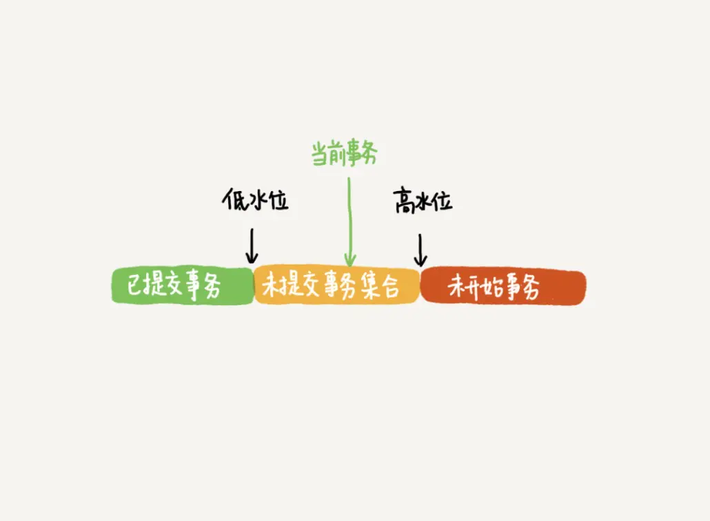

在可重复读隔离级别下，一个事务在启动时，InnoDB 会为事务构造一个数组，用来保存这个事务启动瞬间，当前正在”活跃“的所有事务ID。”活跃“指的是，启动了但还没提交。

数组里面事务 ID 为最小值记为低水位，当前系统里面已经创建过的事务 ID 的最大值加 1 记为高水位。

这个视图数组和高水位，就组成了当前事务的一致性视图（read-view）。

这个视图数组把所有的 row trx_id 分成了几种不同的情况。

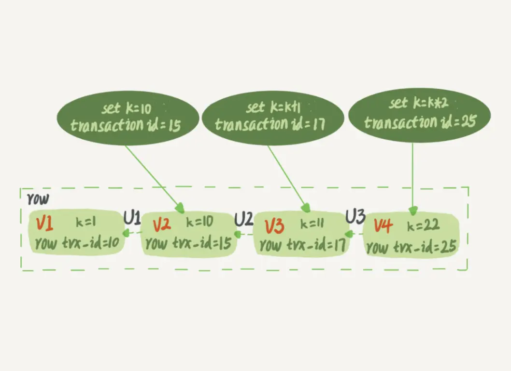

1. 如果 trx_id 小于低水位，表示这个版本在事务启动前已经提交，可见；
2. 如果 trx_id 大于高水为，表示这个版本在事务启动后生成，不可见；
3. 如果 trx_id 大于低水位，小于高水位，分为两种情况：
   1. 若 trx_id 在数组中，表示这个版本在事务启动时还未提交，不可见；
   2. 若 trx_id 不在数组中，表示这个版本在事务启动时已经提交，可见。

**InnoDB 就是利用 undo log 和 trx_id 的配合，实现了事务启动瞬间”秒级创建快照“的能力**

#### Delete\Drop\Truncate

* delete（用于table和view）

  每次从表删一行，删除操作事务记录	

  不减少表和索引占用的空间

* truncate（只用于table）

  一次性删除表中所有数据，不记录日志且无法恢复。

  表和索引占用的空间会恢复

* drop（用于table）

  删除整个表，包括表结构和数据

  表空间释放

#### 用itearte接受数据库查询结果

#### 保证sql的幂等性

* 数据库使用唯一索引

  保证新增sql	

* 全局唯一ID

  适用于微服务场景。唯一ID提取成单独微服务，保证分布式的唯一ID

* 多版本控制

  * sql或者接口中采用状态字段或者版本字段控制

  * 使用过滤字段过滤sql的结果

### Linux常用使用命令

#### 查看某个进程的状态

~~~shell
 ps -ef|grep ams
 
 cat /proc/PID/status
~~~

### 了解哪些设计模式

#### 手敲代码实现单例模式

单例：减少对象的反复实例化，单例只初始化时实例一次对象

双锁单例

~~~java
public class DclSingleton{
  private volatile static DclSingleton dclSingleton;
  private DclSingleton(){
    
  }
  public static DclSingleton instance(){
    if(dclSingleton==null){
      synchronized(DclSingleton.class){
        if(dclSingleton==null){
          dclSingleton=new DclSingleton;
        }
      }
    }
    return dclSingleton;
  }
}
~~~

枚举单例

~~~java
public enum EnumSingleton{
  INSTANCE;
  private final CommonBean commonInstance;
  EnumSingleton{
    this.commonInstance = new CommonBean();
  }
  public CommonBean getInstance(){
    return this.commonInstance
  }
}
~~~

工厂：根据不同需求场景，使用一个类型工厂创建多种对象。例如使用图形工厂类，根据使用场景使用图形工厂类创建不同图形实例，使用工厂创建出来，而不是通过对象自己的构造函数创建。

~~~java
ShapeFactory shapeFactory = new ShapeFactory();
        // 画圆
        Shape circle = shapeFactory.getShape("CIRCLE");
        circle.draw();
        // 画方形
        Shape square = shapeFactory.getShape("SQUARE");
        square.draw();
        // 画三角
        Shape rectangle = shapeFactory.getShape("RECTANGLE");
        rectangle.draw();
~~~

生产消费：典型微服务生产消费者

策略模式：相同接口，多个实现类

### 题目

1. 随机生成 Salary {name, baseSalary, bonus }的记录，如“wxxx,10,1”，每行一条记录，总共1000万记录，写入文本文件（UFT-8编码），
   然后读取文件，name的前两个字符相同的，其年薪累加，比如wx，100万，3个人，最后做排序和分组，输出年薪总额最高的10组：
   wx, 200万，10人
   lt, 180万，8人
   ....
   name 4位a-z随机， baseSalary [0,100]随机 bonus[0-5]随机 年薪总额 = baseSalary*13 + bonus

请努力将程序优化到5秒内执行完

~~~java
@Getter@Setter@ToString
public class Salary  {
    private String name; //员工姓名
    private Integer baseSalary; //基础工资
    private Integer bonus; //奖金
}
/**
 * 生成1000w条随机数据
 */
public class SalaryTest {
    public static void main(String[] args) throws IOException {
        File file = new File("D:/upload/test.txt");
        FileWriter out = new FileWriter(file, true);
        Integer count = 10000000;
        while (true){
            StringBuilder name = new StringBuilder(4);
            String chars = "abcdefghijklmnopqrstuvwxyz";
            for (int i = 0 ; i < 4; i++){
                name.append(chars.charAt((int) (Math.random() * 26))) ;
            }
            Salary salary = new Salary();
            salary.setName(name.toString());
            salary.setBaseSalary((int) (Math.random() * 100 + 1));
            salary.setBonus((int) (Math.random() * 5 + 1));
            count --;
            out.write(JSON.toJSONString(salary));
            out.write("\n");
        if (count ==0){
            out.close();
            return;
        }

        }
    }
}
public class Test {

    public static void main(String[] args) throws IOException {
        long time = new Date().getTime();
        /**
         * 其实也可以用随机流;将文件分块;多起几个线程执行;
          这样的做的话得将文件分块;意思就是通过scan的api;先全文循环后标记;分成几份.
          1000w的数据不大.这样反而效率更低
         */
        BufferedReader reader = new BufferedReader(new FileReader("D:/upload/test.txt"));
        String line = null;
        HashMap<String,Salary> map = new HashMap();
        while((line = reader.readLine()) != null){
            Salary salary = JSON.parseObject(String.valueOf(line), Salary.class);
            String key = salary.getName().substring(0, 2);
            Salary result = map.get(key);
            if (result != null) {
                result.setBaseSalary(result.getBaseSalary() + salary.getBaseSalary() * 13 + salary.getBonus());
                result.setBonus(result.getBonus() +1);
            }else {
                result = new Salary();
                result.setName(key);
                result.setBonus(1);
                result.setBaseSalary(salary.getBaseSalary() * 13 + salary.getBonus());
                map.put(key,result);
            }
        }
        ArrayList<Salary> values = new ArrayList();

         Collection<Salary> co =   map.values();
        values.addAll(co);
      /**
      java8之后提供流排序;效率更高
    **/
        List<Salary> list = map.values().stream().sorted(new Comparator<Salary>() {
            @Override
            public int compare(Salary o1, Salary o2) {
                return o2.getBaseSalary() - o1.getBaseSalary();
            }
        }).collect(Collectors.toList());

       /* Collections.sort( values, new Comparator<Salary>() {
            public int compare(Salary o1, Salary o2) {
                return o2.getBaseSalary() - o1.getBaseSalary();
            }
        });
*/
        System.out.println((new Date().getTime() - time));
        for (int i =0 ; i < 10 ; i++){
            System.out.println(list.get(i));
        }        
   }
}
// 链接：https://www.jianshu.com/p/f092fb562c87
~~~

2. 使用二分查找的方式来定位某一元素

   对于一个有序数组，我们通常采用二分查找的方式来定位某一元素，请编写二分查找的算法，在数组中查找指定元素。给定一个整数数组A及它的大小n，同时给定要查找的元素val，请返回它在数组中的位置(从0开始)，若不存在该元素，返回-1。若该元素出现多次，请返回第一次出现的位置。

~~~java
public int getBinarySearch(int[] nums,int n,int val){
  int high = n-1,low=0,mid=0,flag=-1;
  while(low<=high){
    if(nums[mid]==val){
      flag = mid
    }
    if(nums[mid]<val){
      low=mid+1;
    }
    if(nums[mid]>=val){
      high=mid-1;
    }
  }
  return flag;
}
~~~

3. 请用你熟悉的开发语言，完成如下题目:
   输入:若干个集合,各集合中的元素不会重复
   输出:求这些集合的笛卡尔积例如:
   输入:N个集合(这里N=3) :(a,b)(x,y)(1,2,3)
   输出: ((a,x,1), (a,x,2)…(b,y,3))
   在保证正确性的情况下尽可能优化效率，同时注意代码风格

4. 利用循环的方式实现我输入n 得到n对应的裴波拉契数字，裴波拉契举例：1 1 2 3 5 8 13 21 。。。。。。。

5. 用Java编写一个会导致死锁的程序

   ~~~java
   static Object lock1 = new Object();
   static Object lock2 = new Object();
   
   synchronized(lock1.class){
     synchronized(lock2.class){
       
     }
   }
   
   synchronized(lock2.class){
     synchronized(lock1.class){
       
     }
   }
   ~~~

   

6. Java写代码来解决生产者——消费者问题

   ~~~java
   ShareData shareData = new ShareData();
   // 生产
   for(int i=0;i<10;i++){
     new Thread(()->{
       shareData.increment();
     },"aaa"+i).start()
   }
   // 消费
   for(int i=0;i<10;i++){
     new Thread(()->{
       shareData.decrement();
     },"aaa"+i).start()
   }
   
   class ShareData(){
     private int num=0;
     private Lock lock = new ReentrantLock();
     private Condition condition = lock.newCondition();
     public void increment(){
       lock.lock();
       try{
         while(number!=0){
           condition.await();
         }
         number++;
         conditon.signAll();
       }catch(){
         
       }finally{
   			lock.unlock();
       }
     }
     
     public void decrement(){
       lock.lock();
       try{
         while(number==0){
           condition.await();
         }
         number--;
         condition.signAll();
       }catch(){
         
       }finally{
         lock.unlock();
       }
     }
   }
   
   
   ~~~

   ### 生产问题排查

   1.hash校验问题
   
   2.tomcat临时目录问题
   
   ​      
   
   ### 已面试：
   
   拒：大智慧 13K 全额7% 14薪
   
   途：佰才邦、阿里巴巴
   
   被拒：zoom，蔚来，谊品生鲜
   
   

